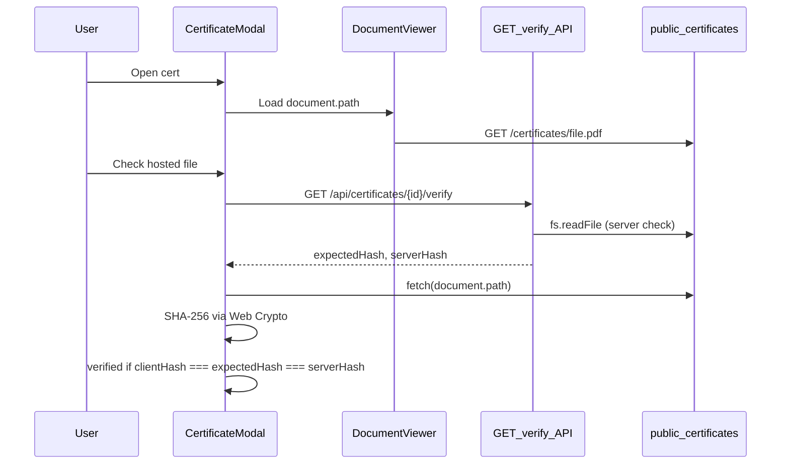

# Fix certificate hash verification flow

## Target trust model



**User-visible meaning:** “The file this site is showing you right now matches the hash we publish.” Expected hash is not shipped in the client bundle; it comes from the API after open/verify.

---

## 1. Canonical certificate identity (fix collisions)

Replace sanitization-based IDs in [`src/lib/certificate-id.ts`](src/lib/certificate-id.ts):

| Today | After |
|--------|--------|
| `cert-{slug}` (lossy, collidable) | `base64url(utf8(filename))` (bijective per filename) |

- `certificateIdFromFilename(filename)` → encode
- `filenameFromCertificateId(id)` → decode + validate against allowlist in `cvdata.json`
- `findCertificateById(id)` → decode id, lookup by **exact** `filename`

Update consumers: [`src/data/documents-data.ts`](src/data/documents-data.ts), [`src/app/certificates/certificate-view.tsx`](src/app/certificates/certificate-view.tsx), hash API route.

**Note:** Existing `?id=cert-javascripttestingcertificate` bookmarks will break (you previously accepted no legacy mapping). IDs in URLs will change once; optional one-line comment in commit message.

---

## 2. Shared visibility registry (fix hidden-cert API leak)

Extract from [`src/data/documents-data.ts`](src/data/documents-data.ts) into [`src/lib/certificate-registry.ts`](src/lib/certificate-registry.ts) (server-safe, no React):

- `isHiddenCertificate(filename)` (existing rules: filename set + human-trafficking course pattern)
- `getVisibleCertificates()` / `findVisibleCertificateById(id)`
- `assertCertificateFilename(filename)` — basename only, no `..`, allowlist charset

Use in:

- `getCertificatesData()` (UI lists)
- API routes (404 for hidden or unknown ids)
- Future CI validator

---

## 3. Server verify API (expected hash stays server-side)

Replace [`src/app/api/certificates/[id]/hash/route.ts`](src/app/api/certificates/[id]/hash/route.ts) with **`/api/certificates/[id]/verify`** (or keep `/hash` and extend response—prefer one endpoint):

**Response (example):**

```json
{
  "certificateId": "...",
  "filename": "JavaScriptTestingCertificate.pdf",
  "expectedHash": "<from cvdata.json>",
  "serverHash": "<sha256 of file on disk>",
  "match": true,
  "algorithm": "SHA-256"
}
```

Implementation in new [`src/lib/certificate-verify-server.ts`](src/lib/certificate-verify-server.ts) (import `"server-only"`):

- Resolve cert by id via registry
- Reject hidden / unknown → 404
- Read file with existing `path.resolve` prefix guard + `assertCertificateFilename`
- Compare `serverHash` to `expectedHash`; set `match`

Keep [`src/lib/certificate-hash.ts`](src/lib/certificate-hash.ts) only if needed for thin wrappers, or fold into server module and delete client imports.

**Remove** `findCertificateHash` from any `"use client"` import chain ([`src/components/verification-hash.tsx`](src/components/verification-hash.tsx) currently pulls `cvdata.json` into the bundle).

---

## 4. Client verification UI (hosted-bytes check)

Refactor [`src/components/verification-hash.tsx`](src/components/verification-hash.tsx):

**New props:** `certificateId`, `documentPath` (e.g. `/certificates/foo.pdf`), `compact`

**Behavior:**

1. Do **not** show expected hash on first paint (no precalculated hash in UI).
2. Button label: **“Check hosted file”** (not “Verify” implying local download).
3. On click:
   - `GET /api/certificates/{id}/verify` → `expectedHash`, `serverHash`, `match`
   - `fetch(documentPath, { cache: 'no-store' })` → `arrayBuffer()` → `crypto.subtle.digest('SHA-256', …)` → hex `clientHash`
   - **Verified** only if `clientHash === expectedHash` (and optionally surface mismatch if `serverHash !== clientHash` for deploy/cache debugging)
4. Update info modal copy: explains this checks the **hosted copy in the viewer**, and separately documents how to verify a **downloaded** file offline (existing certutil/shasum instructions—no false claim that the button hashes downloads).

Add small helper [`src/lib/sha256-hex.ts`](src/lib/sha256-hex.ts) (browser-safe) for ArrayBuffer → hex string.

Wire `documentPath` from [`src/components/document-viewer.tsx`](src/components/document-viewer.tsx): `document.path` + `document.id`.

---

## 5. CI / ops guardrails

Add [`scripts/validate-certificates.mjs`](scripts/validate-certificates.mjs) (or `.ts` run via `node --experimental-strip-types` if preferred):

- Every `cvdata.certificates[].filename` has unique `certificateIdFromFilename`
- File exists under `public/certificates/`
- On-disk SHA-256 matches `sha256Hash` (reuse logic from [`scripts/calculate-hashes.ts`](scripts/calculate-hashes.ts))
- Warn or fail on missing `sha256Hash`

Wire into [`package.json`](package.json): `"validate-certificates": "node scripts/validate-certificates.mjs"` and run in CI alongside `pnpm test:unit` (or document in [`AGENTS.md`](AGENTS.md) pre-release step).

---

## 6. Tests

- Update [`src/lib/certificate-id.test.ts`](src/lib/certificate-id.test.ts) → registry/id round-trip + collision regression (two synthetic filenames that would collide under old sanitizer)
- Add API route test (vitest) mocking fs or testing 404 for hidden id with known filename from cvdata
- Optional: unit test for `sha256-hex` with known vector

---

## 7. Files touched (summary)

| Action | File |
|--------|------|
| Rewrite | `src/lib/certificate-id.ts`, `src/lib/certificate-registry.ts` |
| New | `src/lib/certificate-verify-server.ts`, `src/lib/sha256-hex.ts` |
| Replace/extend | `src/app/api/certificates/[id]/verify/route.ts` (rename from `hash`) |
| Refactor | `src/components/verification-hash.tsx`, `src/components/document-viewer.tsx` |
| Update | `src/data/documents-data.ts`, `src/app/certificates/certificate-view.tsx` |
| New script | `scripts/validate-certificates.mjs` |
| Tests | `src/lib/certificate-id.test.ts`, optional API test |

---

## Verification (after implementation)

```bash
pnpm validate-certificates   # new
pnpm test:unit
pnpm type-check
pnpm lint
```

Manual: open `/certificates?id=<newId>`, click **Check hosted file** → verified; change a byte in `public/certificates/` without updating `cvdata.json` → fails; hidden cert id via API → 404.
