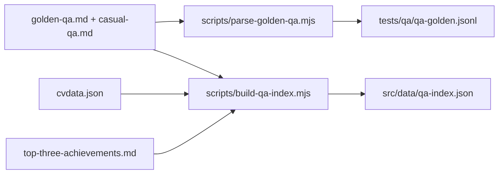
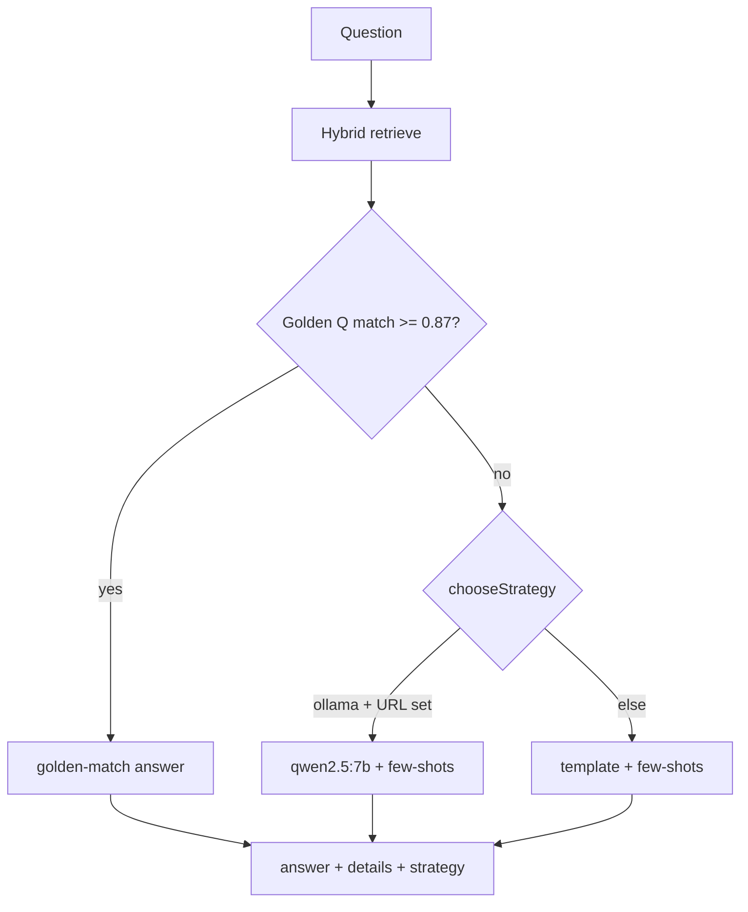
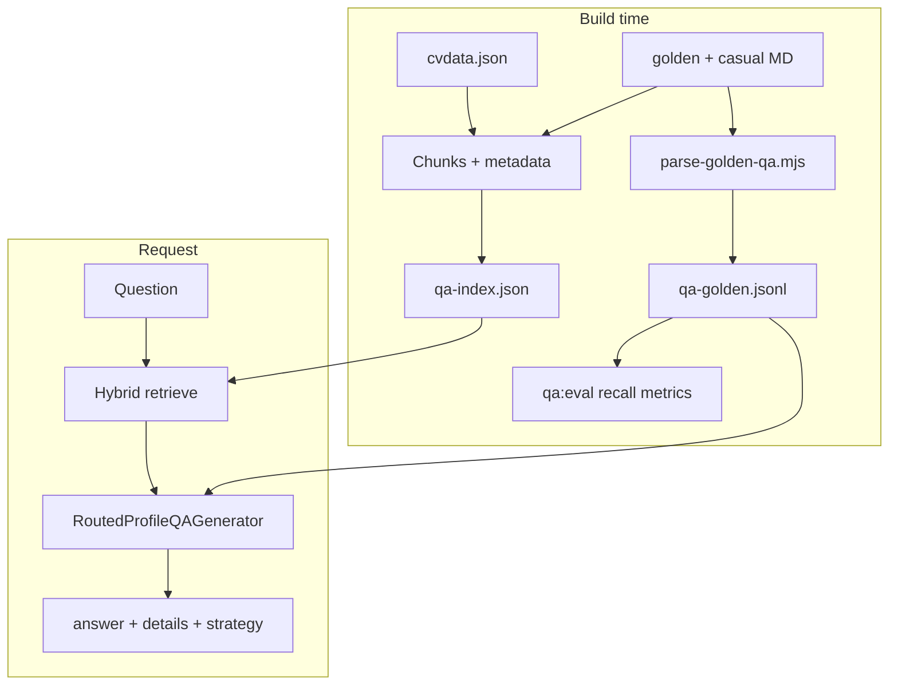

# Profile QA: evaluation and recommended path

## Executive summary

| Approach | Verdict |
|----------|---------|
| **[PR #33](https://github.com/p10ns11y/devprofile/pull/33) (`canary`)** — xAI Grok + Vercel AI SDK tools | **Do not merge.** High quality spike, but paid API, stale stack (`bun.lock`, mixed embedding models), and wrong fit for “local only.” |
| **`origin/feature/infrencer`** — FLAN-T5 fine-tune + Gemma-270m in-route | **Do not revive fine-tuning.** Legacy `qa_data.jsonl` superseded by [`golden-qa.md`](src/data/golden-qa.md) + [`casual-qa.md`](src/data/casual-qa.md). |
| **`main` today** — MiniLM RAG + template `generateAnswer()` | **Keep as base**, but it is not “AI QA” in practice: `distilgpt2` is loaded and never used; relevance threshold `0.4` is harsh; answers are regex templates, not synthesis. |

Your corpus is **small but now two-layered**:

| Layer | Files | Role |
|-------|--------|------|
| **Factual CV** | [`cvdata.json`](src/data/cvdata.json) | Structured SSOT: employers, dates, skills, projects |
| **Golden narrative** | [`golden-qa.md`](src/data/golden-qa.md) (~30 interview pairs), [`casual-qa.md`](src/data/casual-qa.md) (20 warm-up pairs), [`top-three-achievements.md`](src/data/top-three-achievements.md) | Best xAI-era voice, nuance (EEaaS thesis, Dad mode, premflow, devprofile/.agents) — **eval + few-shot + extra index chunks** |

This changes the plan: the golden Markdown is not optional polish — it is the **regression suite and quality floor** from Phase 0.

**Refined principle (Grok 4.3 v2):** Ship minimal + $0 on Vercel, but make golden QA the foundation for **measurement, few-shot prompting, and continuous improvement**.

**Refined principle (Grok v3 + your feedback):** Templates are a **ceiling**, not the goal. Add a **Smart Router** so Ollama runs automatically on narrative and low-confidence questions when `OLLAMA_BASE_URL` is set; use **golden-match** for chip questions; templates only for short factual Qs or when Ollama is unavailable.

| Concern | Resolution in plan |
|---------|-------------------|
| Template quality ceiling | Router → Ollama for narrative / avgSim &lt; 0.65; golden-match for near-duplicate Qs |
| Weak generator switching | `chooseStrategy()` + logged `strategy` per response; eval per route |
| Machine-like tone (your words) | Prefer Ollama + golden ideals over template assembly for interview-style Qs |

---

## Golden QA as first-class citizen

### What you already have (highest-leverage asset)

- [`golden-qa.md`](src/data/golden-qa.md) — deep behavioral/technical pairs (2016 thesis → 2026 Dad mode, Oneflow, Zod, premflow, agents).
- [`casual-qa.md`](src/data/casual-qa.md) — short warm-up questions for UI chips and casual visitors.
- [`top-three-achievements.md`](src/data/top-three-achievements.md) — curated “top 3” narrative; wire to achievements intent (replace or augment `generateAchievementsAnswer`).

Legacy [`cv-inferencer/qa_data.jsonl`](origin/feature/infrencer) on the inferencer branch is **lower priority** than these Markdown files (synthetic, flatter answers).

### Build-time pipeline



**`qa-golden.jsonl` record shape** (one line per Q&A):

```json
{
  "id": "golden-12-premflow",
  "question": "Why does premflow still matter in 2026?",
  "idealAnswer": "...",
  "tier": "golden|casual",
  "category": "builder|leadership|forward",
  "expectedSections": ["Projects", "Experience 3"],
  "tags": ["premflow", "c"]
}
```

- `expectedSections` — optional, hand-tagged over time; drives **retrieval recall@3/@5** metrics.
- Parser: regex on `**Q:` / `**A:` blocks; dedupe overlapping pairs in `golden-qa.md` (original 8 + refreshed 22).

### Dual-source grounding policy

| Source type | In index? | In generation? | In eval? |
|-------------|-----------|----------------|----------|
| `cvdata` chunks | Yes | Primary facts | Expected sections for factual Qs |
| `golden` / `casual` chunks (Q+A text) | Yes | Retrieved context | Ideal answer for similarity |
| Few-shot examples (3–5 pairs) | No (prompt only) | Style/tone anchor | N/A |

**Rule:** Generators must not invent employers/dates/skills **not present in retrieved chunks**. Golden ideal answers are for **eval and few-shot**, not permission to hallucinate beyond retrieval.

### Generator abstraction + Smart Router (Phase 1)

**Agreed concern (you + Grok):** Templates + few-shots raise the floor but hit a **hard ceiling** on narrative depth (thesis arc, Dad mode, “why/how” philosophy). That is why xAI felt “best” — dynamic structure, not regex assembly. Few-shots help *tone*; they do not replace a small local model for *adaptation*.

**Design:** One facade, explicit routing, no manual switches later.

```ts
// src/lib/profile-qa-generator.ts
type GenerationStrategy = "golden-match" | "template" | "ollama";

interface ProfileQAGenerator {
  chooseStrategy(
    question: string,
    context: RetrievedChunk[],
    opts: { ollamaAvailable: boolean },
  ): GenerationStrategy;

  generate(params: {
    question: string;
    context: RetrievedChunk[];
    goldenFewShots: GoldenExample[]; // 4–5 category-matched from qa-golden.jsonl
  }): Promise<{ answer: string; details: RetrievedChunk[]; strategy: GenerationStrategy }>;
}
```

**`RoutedProfileQAGenerator`** delegates to:

| Strategy | Implementation | When |
|----------|----------------|------|
| `golden-match` | `GoldenMatchGenerator` | Question embedding similarity to a golden Q ≥ **`GOLDEN_MATCH_THRESHOLD` (default 0.87**, tune 0.85–0.88 via eval) — returns curated human voice, $0 |
| `ollama` | `OllamaGenerator` | `OLLAMA_BASE_URL` set **and** `chooseStrategy` says narrative/complex (below) |
| `template` | `TemplateGenerator` | Fallback: simple factual intents, or **no Ollama** (Vercel-only deploy) |

**`chooseStrategy` routing (~15 lines, tunable constants in `qa-router.ts`):**

```ts
// Upgrade to ollama when Ollama is available AND any of:
const avgSim =
  context.reduce((s, c) => s + c.similarity, 0) / Math.max(context.length, 1);
const wordCount = question.trim().split(/\s+/).length;
const isNarrative =
  /\b(why|how do you think|what's your view|compare|reflect|philosophy|trade-?off|biggest lesson|walk me through|tell me about)\b/i.test(
    question,
  ) || wordCount > 18;

if (opts.ollamaAvailable && (avgSim < 0.65 || isNarrative)) return "ollama";
return "template";
```

- **Default when Ollama available:** prefer `ollama` for narrative / low-confidence retrieval; reserve `template` for short factual queries (“What’s your email?”, “List React skills”) where structure is enough.
- **Log `strategy`** on each response (dev + eval) so you can tune thresholds from golden failures.



**Deployment honesty (important):**

| Environment | Human touch | What you get |
|-------------|-------------|--------------|
| Vercel, no `OLLAMA_BASE_URL` | Limited | `golden-match` + `template` only — fast, $0, can feel “machine” on novel narrative Qs |
| Dev / prod with `OLLAMA_BASE_URL` | High | Router sends hard questions to Ollama — closest to xAI AMA without API cost |
| Recommended for quality you care about | Self-hosted Ollama (home, Fly, Modal) behind env URL | Same codebase; router does the right thing automatically |

Templates are **fallback**, not the product. Phase 2 eval should report **per-strategy** golden overlap (template vs ollama vs golden-match).

### Eval harness — **from Phase 0, not Phase 3**

`pnpm qa:eval` (runs in CI on PR + locally):

| Metric | How |
|--------|-----|
| **Retrieval recall@3 / @5** | For each golden row with `expectedSections`, any retrieved chunk section matches? |
| **“Don’t know” rate** | % answers containing refusal phrase when golden expects substance |
| **Answer overlap** | Token overlap / ROUGE-L vs `idealAnswer` (cheap, no LLM) |
| **Faithfulness (optional)** | When Ollama available: does answer mention entities not in retrieved context? |
| **Per-strategy quality** | ROUGE-L on golden tier split by `strategy` (target: `ollama` + `golden-match` ≫ `template` on narrative subset) |

**Gate (initial targets):** recall@5 ≥ 85% on tagged subset; “don’t know” &lt; 10% on golden tier; narrative golden subset ROUGE-L higher on `ollama` route than `template` when Ollama enabled in eval.

---

## Reconciliation with Grok 4.3’s evaluation

Grok’s write-up **agrees on fundamentals** (RAG beats fine-tuning for your corpus; PR #33 was the right instinct; keep answers grounded and updatable). It could not read the private repo, so a few assumptions differ from what is actually on `main`:

| Grok 4.3 said | Actual on `main` (May 2026) | Plan adjustment |
|---------------|-----------------------------|-----------------|
| Live “AI AMA” powered by transformers doing real chat | [`/api/cv/qa`](src/app/api/cv/qa/route.ts) uses MiniLM retrieval + **regex templates**; `distilgpt2` is loaded but **never called** | Phase 1 is the real “rewrite QA”; don’t assume LLM generation already exists |
| New `/data/profile/*.md` knowledge tree | You added [`src/data/golden-qa.md`](src/data/golden-qa.md) etc. **in-repo** (not a second tree) | **Use these files** — parse to JSONL + ingest as `source: golden\|casual` chunks; `cvdata.json` stays factual SSOT |
| Groq / xAI as primary generation | You chose **local-only** (xAI quality, no ongoing cost) | **Smart Router:** Ollama when URL set + narrative/low-confidence; templates only as fallback; golden-match for chip questions. No paid API in prod |
| Chroma / SQLite / Upstash for vectors | ~150 chunks total | **In-memory index** serialized to `qa-index.json` — no DB until corpus grows 10× |
| `bge-m3` / Arctic embeddings | `@huggingface/transformers` + MiniLM today | **Phase 1:** keep MiniLM or switch to `nomic-embed-text` via Ollama at index-build time; **optional later:** `bge-m3` if eval shows retrieval gaps |
| LangChain / LlamaIndex | Not in `package.json` | **Custom thin RAG** in-repo (fits pnpm policy + tiny corpus); avoid framework weight unless you split to `ama-about-me` |
| Phase 3 LoRA / Unsloth voice fine-tune | `infrencer` already proved data too small | **Defer indefinitely** unless golden eval + RAG+Ollama still fail on *style* only; synthetic Q&A from Grok **once** → eval set, not training set |

**Adopt from Grok (added to phases below):**

- **Strict profile guardrail prompt** (first person, context-only, explicit “don’t know” + redirect).
- **Golden Q&A** — now satisfied by [`golden-qa.md`](src/data/golden-qa.md) + [`casual-qa.md`](src/data/casual-qa.md) (automated eval from Phase 0).
- **Suggested questions** per section (Oneflow, React, projects, etc.) on QA UI.
- **Sources sidebar** — extend existing “Retrieved Information” `details` panel with section labels.
- **Later polish:** export conversation snippet via existing [`@react-pdf/renderer`](package.json) pipeline; log unanswered queries for corpus gaps.



---

## What each spike actually did

### PR #33 (`canary`) — what was good

- **Semantic chunking** with importance scores ([`src/utils/cv-embedding.ts`](src/utils/cv-embedding.ts) on `canary`) — better than sentence-level flattening in [`src/utils/qa-utils.ts`](src/utils/qa-utils.ts).
- **Tool-shaped retrieval** ([`src/utils/cv-tools.ts`](src/utils/cv-tools.ts)) — `cvSearch`, work experience, skills; good mental model for profile QA.
- **Streaming chat UI** (`ama-v2`, AI SDK) — polish you may want later on QA only.

### PR #33 — why not merge

- **Cost:** `xai/grok-4.1-fast-reasoning` in [`src/app/api/chat/route.ts`](src/app/api/chat/route.ts) — contradicts local-only production.
- **Incomplete:** PR note “Embedding model is not setup yet”; code mixes `text-embedding-3-small` and `google/text-embedding-005`.
- **Drift:** `bun.lock`, `workflow` beta, not aligned with current **pnpm + App Router** on `main`.
- **Wrong product surface:** `ama-v2` — you want **profile QA**, not AMA.

### `origin/feature/infrencer` — lessons

- **RAG + local generation** in `src/pages/api/cv/qa.ts` was the right *shape* (retrieve → prompt → generate), but **Gemma 270m** and **FLAN-T5 on 390 rows** cannot produce stable interview-quality answers.
- **`qa_data.jsonl`** — reuse as **regression tests** (expected answers for ~20–30 canonical questions), not training data.
- **Lower thresholds** (`0.04–0.05`) fit a small domain; `main`’s `0.4` explains many “I don’t have information” responses.

---

## Recommended strategy (2026, local-only, small data)

### Principle: retrieval-first, generation-second

For a CV-sized corpus, quality comes from:

1. **[Contextual retrieval](https://www.anthropic.com/engineering/contextual-retrieval)** — prepend 1–2 sentences to each chunk before embedding (e.g. “This is Peramanathan’s Oneflow role, 2021–present…”) — can be **authored in build script** from `cvdata` fields; no paid LLM required at your scale.
2. **[Hybrid search](https://www.meilisearch.com/blog/hybrid-search-rag)** — BM25 (exact: “Oneflow”, “React Native”, cert names) + dense vectors; fuse with **RRF** (reciprocal rank fusion).
3. **Structured chunks** — one chunk per work role, project, skill category, cert; not arbitrary sentence splits (port ideas from `canary`’s `createWorkExperienceChunks`, etc.).
4. **Grounded synthesis** — local LLM only **rewrites retrieved facts**; use Grok-style guardrails (adapted for your voice):

```ts
// src/lib/qa-prompts.ts — system prompt for Ollama / any future generator
export const PROFILE_QA_SYSTEM = `You are Peramanathan Sathyamoorthy's profile assistant.
Answer ONLY from the retrieved context (CV, experience, projects, skills).
If a fact is not in context, say: "I don't have that in my profile yet." Then suggest one related topic you can answer from context.
Use first person. Be concise, professional, interview-appropriate. End with which section(s) you used.`;
```

5. **Golden paths without LLM** — keep intro/career template bypasses; load achievements from [`top-three-achievements.md`](src/data/top-three-achievements.md); optional **near-duplicate golden match** fast path for suggested-question chips.

**Do not fine-tune (Phase 3+ only if style — not facts — fails eval).** With ~400 Q&A rows, [fine-tuning underperforms a strong RAG pipeline](https://arxiv.org/html/2511.10297v1) for factual Q&A. Grok’s “synthetic dataset via Grok once → LoRA” is a **last resort**, not Phase 1–2.

### Local LLM choice (when you want xAI-like fluency)

| Model | Role | Notes |
|-------|------|--------|
| **Embeddings:** `Xenova/all-MiniLM-L6-v2` (keep) or **Ollama `nomic-embed-text`** | Index + query | Precompute at build; drop runtime `prepareData()` cold start on Vercel |
| **Generation:** **Ollama `qwen2.5:7b`** (or `qwen3:8b` if tool-calling later) | Synthesis only | [Qwen2.5](https://ollama.com/library/qwen2.5) — far beyond Gemma-270m / FLAN-T5; 3b possible for dev, 7b+ recommended for natural interview tone |
| **Vercel production** | No Ollama in serverless | See deployment split below |

**Important deployment constraint:** [`next.config.mjs`](next.config.mjs) + Vercel serverless **cannot host Ollama**. “Local only” means:

- **Production (Vercel, no Ollama URL):** hybrid retrieval + **golden-match** + templates — acceptable for factual Qs; narrative quality will lag xAI (known ceiling).
- **Quality tier:** `OLLAMA_BASE_URL` → Smart Router auto-upgrades narrative/low-confidence to **qwen2.5:7b** (14b optional on capable hardware) — this is the path to human touch without xAI bills.

This matches your [`ama-about-me`](https://github.com/p10ns11y/ama-about-me) direction (LangChain/Ollama) but keeps one codebase in devprofile.

---

## Product: `/qa` only

- **Single surface:** [`/qa`](src/app/qa/page.tsx) + [`ProfileQA`](src/components/profile-qa.tsx) → `POST /api/cv/qa`.
- **Removed:** `/ama`, `/quick-cv-actions`, `ai-chat.tsx`, server `askQuestion`, `feature-flags.ts` AMA entries — never public; no redirects needed.
- **E2E:** [`tests/e2e/qa.spec.ts`](tests/e2e/qa.spec.ts) on `/qa`.
- **Copy:** “Profile Q&A” / interview-style QA (not AMA).

---

## Implementation phases (golden-centered)

| Phase | Focus | Golden QA role | Effort |
|-------|--------|----------------|--------|
| **0** | Pipeline + baseline metrics | Parse MD → JSONL; first `qa:eval` on **current** stack | ~1 day |
| **1** | Core QA system | Few-shot templates; hybrid index; generator interface; achievements from `top-three-achievements.md` | ~3–4 days |
| **2** | Polish + Ollama | Suggested Qs from golden+casual; CI eval gate; track failing golden IDs | ~2 days |
| **3** | Optional | Synthetic expansion **only if** eval plateaus; LoRA deferred | Later |

### Phase 0 — Golden pipeline + baseline eval (~1 day)

- [`scripts/parse-golden-qa.mjs`](scripts/parse-golden-qa.mjs): [`golden-qa.md`](src/data/golden-qa.md) + [`casual-qa.md`](src/data/casual-qa.md) → [`tests/qa/qa-golden.jsonl`](tests/qa/qa-golden.jsonl).
- Tag ~10–15 rows with initial `expectedSections` (Oneflow, Zod, premflow, thesis, etc.).
- [`scripts/build-qa-index.mjs`](scripts/build-qa-index.mjs) v0: `cvdata` + golden/casual Q&A as chunks (`source`, `category`, `tier` metadata).
- [`scripts/qa-eval.mjs`](scripts/qa-eval.mjs) + `pnpm qa:eval` — run against **today’s** `/api/cv/qa` to establish baseline recall / don’t-know rate.
- Remove unused `distilgpt2` in [`qa-utils.ts`](src/utils/qa-utils.ts).

### Phase 1 — Routed generators + hybrid RAG (~3–4 days)

- Complete index: contextual prefixes, hybrid BM25 + embeddings, RRF → [`src/data/qa-index.json`](src/data/qa-index.json); hook `pnpm build`.
- [`src/lib/qa-router.ts`](src/lib/qa-router.ts) + [`src/lib/profile-qa-generator.ts`](src/lib/profile-qa-generator.ts): `RoutedProfileQAGenerator` with `chooseStrategy`, `TemplateGenerator`, `OllamaGenerator`, `GoldenMatchGenerator`.
- Ollama: `qwen2.5:7b` default; document `qwen2.5:14b` when GPU allows.
- Refactor [`src/app/api/cv/qa/route.ts`](src/app/api/cv/qa/route.ts) — return optional `strategy` field for debugging; keep `{ answer, details }` for UI.
- Load [`top-three-achievements.md`](src/data/top-three-achievements.md) for achievements intent.
- Re-run `pnpm qa:eval` — recall@5 + baseline per-strategy scores.

### Phase 2 — Router tuning + product polish (~2 days)

- Tune `avgSim` (0.65), narrative regex, golden-match (start **0.87**, eval sweep 0.85–0.92) using golden failures.
- Extend `pnpm qa:eval` with Ollama-enabled run (CI optional/skipped if no URL; required locally before release).
- UI: suggested questions from `casual-qa` + `golden-qa`; show `strategy` in dev disclaimer.
- CI: retrieval gate on PR; document **“for human-quality narrative QA, set `OLLAMA_BASE_URL`”** in README and [`tests/qa/README.md`](tests/qa/README.md).
- Legacy AMA routes removed; `/qa` is the only UI surface.

### Phase 3 — Observability + optional extras

- Faithfulness checks; unanswered-query log; export snippet (low priority).
- **Do not** LoRA / synthetic fine-tune unless eval shows **style-only** gap with RAG + Ollama + few-shots.
- Optional dev-only `XAI_API_KEY` to score new answers against golden ideals (judge), not production inference.

### Explicitly out of scope (even after Grok review)

- Merging PR #33 wholesale; Groq/xAI as **production** primary.
- Parallel Markdown knowledge repo under `/data/profile/`.
- Chroma / pgvector / Upstash until chunk count justifies it.
- FLAN-T5 / `cv-inferencer/` fine-tune pipeline.
- LoRA / Unsloth **unless** Phase 3 eval shows style-only failure with RAG+Ollama.

---

## What to salvage from old branches (cherry-pick, not merge)

| From | Take |
|------|------|
| `canary` | Semantic chunking, tool categories, importance weighting |
| `canary` | **Not** xAI chat route, workflow beta, `ama-v2` |
| `infrencer` | Synthesis prompt tone, lower similarity thresholds (if eval still shows false refusals) |
| `infrencer` | **Not** `fine_tune.py`, Gemma-270m route, Pages Router `qa.ts` |

---

## Success criteria (measurable via golden set)

- **Retrieval:** recall@5 ≥ 85% on golden rows with `expectedSections` (raise target as tags improve).
- **Refusal rate:** &lt; 10% false “don’t know” on `tier: golden` questions.
- **Answer quality:** On narrative golden subset, `ollama` + `golden-match` routes beat `template` on ROUGE-L when Ollama enabled; templates acceptable only on factual subset.
- **Achievements:** “top 3 achievements” questions align with [`top-three-achievements.md`](src/data/top-three-achievements.md) content.
- **Regression:** CI `pnpm qa:eval` blocks PRs that drop retrieval metrics.
- **Ops:** Vercel default = $0, no API keys; cold start &lt;2s with prebuilt index.

---

## Branch disposition

- **Close or archive PR #33** with comment: superseded by local RAG v2 plan; xAI spike retained for prompt/chunking ideas only.
- **Leave `origin/feature/infrencer`** as historical reference; do not merge.
- **Implement on `main`** in small PRs: Phase 0 → Phase 1 → Phase 2.
