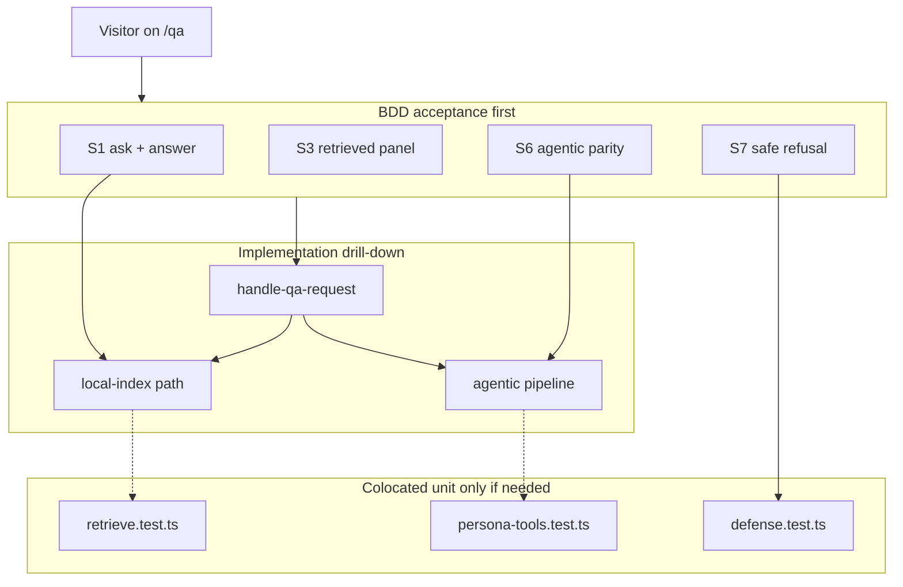

# QA workflow refactor (BDD-first within TDD)

## Governing approach

**BDD before unit TDD.** The **visitor on `/qa`** is the center of gravity—not modules, PR numbers, or internal flags. Every change starts from a **user scenario** (Given / When / Then), expressed as a failing **acceptance test**, then drills into colocated unit tests **only** where that scenario needs finer decomposition.

**Red → green → refactor cycle:**

1. **RED:** Add or extend a scenario in [`src/lib/qa/features/`](src/lib/qa/features/) (acceptance-level, calls `handleQaRequest` or route handler).
2. **GREEN:** Implement the thinnest production path so the **user-visible outcome** passes (answer text, `details[]`, headers the UI cares about).
3. **REFACTOR:** Extract modules (`local-index/`, `agentic/pipeline/`, etc.); add or tighten **colocated** unit tests when a scenario exposes a gap (retrieval scores, defense non-bypass, six tools)—not before.

**Do not big-bang move files first.** Production layout ([target structure](#target-folder-layout)) follows **scenario coverage**, not the reverse.

**Colocated tests (binding):** Acceptance scenarios in `src/lib/qa/features/*.feature.test.ts`; supporting unit tests beside implementation; shared helpers in `src/lib/qa/test/` only. **No** root `__tests__/qa/`.

**Review units:** One feature branch, **logical commits per user scenario or scenario group** (see [Delivery](#delivery-logical-commits-one-branch-ok)), each with `pnpm test:unit` green.

### Test pyramid (user-centered)

```
  Playwright E2E (thin)     tests/e2e/qa.spec.ts — same scenarios, real browser
           ▲                      1:1 IDs with Vitest acceptance where possible
  BDD acceptance (Vitest)   src/lib/qa/features/*.feature.test.ts  ← write FIRST
           ▲
  Colocated unit tests        *.test.ts next to modules — only to support scenarios
           ▲
  Golden eval (retrieval)     pnpm test:golden — quality gate for “good sources”
```

**No Cucumber dependency** (solo/portfolio realism): use Vitest `describe` / `it` with **scenario titles in plain language** and optional `src/lib/qa/test/bdd.ts` helpers (`given`, `when`, `then` as thin wrappers for readability).

### Relationship to [grok-design-doc-7f04db24.md](.grok/plans/grok-design-doc-7f04db24.md)

| Design doc concern | BDD expression |
|--------------------|----------------|
| Dual-path / kill switch | Scenario: “visitor gets an answer” with reactor **off** vs **on** |
| Defense-first | Scenario: “visitor asks an off-topic/abusive question” → safe answer, **no** Grok/Collections mock calls |
| Response shape | Scenario asserts what **ProfileQA** needs: `answer`, `details[]`, optional strategy/header |
| RRF / recall@5 | Scenario: “answer is grounded in retrieved sections” + `test:golden` when changing retrieve |
| Property/contract depth | **Supporting** tests under a scenario—not standalone slice 2 “types only” |

**Design doc scope split:**

| In this refactor plan | Referenced, implement in design-doc PRs |
|-----------------------|----------------------------------------|
| Vitest harness + contract tests for modules we touch | Full 1360 LOC conversion details (design doc **PR 1**) |
| Contract + example-based tests per slice | fast-check property tests (design doc **PR 2**) |
| `retrieve` / golden-match invariants | `test:golden` + CI yaml + HF cache (design doc **PR 3**) |
| Stable `data-testid` when gateway/route done | E2E volatile-copy cleanup (design doc **PR 4**) |

---

## User scenario catalog (source of truth)

Scenarios are numbered for traceability in commits and E2E. Implement **in this order** (default path before agentic).

| ID | As a… | I want to… | So that… | Acceptance file | E2E twin |
|----|--------|------------|----------|-----------------|----------|
| **S1** | visitor on `/qa` | submit a question and see an answer | I learn about the profile | `features/ask-question.feature.test.ts` | [`qa.spec.ts`](tests/e2e/qa.spec.ts) submit test |
| **S2** | visitor | pick a suggested question | I explore without typing | same | suggested button (stable role/label) |
| **S3** | visitor | see “Retrieved information” with the answer | I trust grounding | same | `getByText("Retrieved information")` |
| **S4** | visitor (default deploy) | get a fast answer on repeat question | wait time is low | `features/cache.feature.test.ts` | optional |
| **S5** | visitor | get a sensible answer when Ollama is down | the page still works | `features/local-fallback.feature.test.ts` | optional |
| **S6** | visitor (reactor on) | get the same JSON shape as default | the UI does not break | `features/agentic-parity.feature.test.ts` | [`qa-reactor.spec.ts`](tests/e2e/qa-reactor.spec.ts) API shape |
| **S7** | visitor (reactor on) | be turned away from abusive prompts safely | the site stays professional | `features/safe-refusal.feature.test.ts` | reactor defense (env-gated E2E) |
| **S8** | developer | run QA locally without xAI keys | I can iterate offline | `features/local-profile-data.feature.test.ts` | n/a (unit/acceptance) |

**Example acceptance structure** (Vitest BDD, no Gherkin parser):

```ts
describe("Feature: Ask a profile question", () => {
  describe("Scenario S1: visitor submits a question and receives an answer with sources", () => {
    it("returns a non-empty answer and details the ProfileQA panel can render", async () => {
      const res = await handleQaRequest("What is your email?", { mode: "local-index" });
      expect(res.answer.length).toBeGreaterThan(0);
      assertQaResponseForVisitor(res); // from test/contracts.ts
    });
  });
});
```

---

## Technical invariants (support scenarios, not drive naming)

Implement only when a **scenario above** requires them. Shared asserts live in [`src/lib/qa/test/contracts.ts`](src/lib/qa/test/contracts.ts):

1. **Vitest + hoisted `vi.mock`** — fixes post-import mutation in `persona-reactor.test.ts` (design doc Key Decision #1).
2. **Critical-only coverage** — `src/lib/qa/**` + `src/app/api/cv/qa/route.ts` (design doc § Test Infrastructure).
3. **Dual-path invariant** — `ENABLE_XAI_REACTOR` only; legacy path bit-identical when off; reactor dynamically imported (design doc § Feature / kill switch).
4. **Defense-first** — `checkAbuse` before any Collections/Grok spend; golden on block (design doc § Critical code + reactor diagram).
5. **Collections vs local retrieval** — reactor tools: xAI Collections OR `USE_LOCAL_PROFILE_DATA` keyword search; **no** HF/MiniLM on reactor path (design doc invariants).
6. **Local-index path** — hybrid RRF in `retrieve.ts`, golden match, Ollama optional; separate from agentic (design doc § Background).
7. **Response compatibility** — `{ answer, details[] }` for ProfileQA; optional `X-QA-Reactor` / `X-QA-Version` headers (design doc § API).
8. **Tool registry contract** — exactly six tool names; `formatSearchResults` shape (design doc § Property/Contract PR 2).
9. **Golden eval gate** — `recall@5 ≥ 85%` on `tests/qa/qa-golden.jsonl` guards retrieval quality (design doc § Golden Eval)—run manually until PR 3 lands; add to slice 3 checklist.

---

## Quick context (unchanged problem)

Profile Q&A is **two backends behind one API**:

| Path | When | Retrieval | Generation |
|------|------|-----------|------------|
| **Local index** | Default | `qa-index.json` + optional MiniLM | Golden → template or Ollama |
| **Agentic** | `ENABLE_XAI_REACTOR=true` | Collections or local keyword files | Grok + tools |

Pain: flat layout, duplicate `runProfileQA` names, stub/orphan modules, PR-era comments, stale README, tests not run via `pnpm test`.



---

## XState (unchanged recommendation)

- **Flags/config:** plain functions in `config/resolve-qa-mode.ts`, not XState.
- **Client:** keep `useReducer` until streaming UI (then XState per [react-client-roadmap.md](docs/react-client-roadmap.md)).
- **Server reactor:** explicit pipeline stages + discriminated unions first; XState only if durable/cancel/stream complexity appears.

---

## Target folder layout

Production + **colocated** `*.test.ts` / `*.contract.test.ts` (same folder as module under test). Applied incrementally per slice; Phase 8 removes legacy flat files and shims.

```
src/lib/qa/
├── README.md                      # user flow + scenario table (not PR history)
├── index.ts
├── features/                      # BDD acceptance — write BEFORE drilling down
│   ├── ask-question.feature.test.ts      # S1, S2, S3
│   ├── cache.feature.test.ts             # S4
│   ├── local-fallback.feature.test.ts    # S5
│   ├── agentic-parity.feature.test.ts    # S6
│   ├── safe-refusal.feature.test.ts      # S7
│   └── local-profile-data.feature.test.ts # S8
├── test/                          # shared helpers only
│   ├── contracts.ts               # assertQaResponseForVisitor, headers
│   ├── bdd.ts                     # optional given/when/then labels
│   └── fixtures/
├── config/
│   ├── resolve-qa-mode.ts
│   ├── resolve-qa-mode.test.ts
│   └── env.ts
├── shared/
│   ├── types/{local,agentic}.ts
│   ├── types.local.test.ts        # or types/local.test.ts beside split files
│   ├── profile-sources.ts
│   └── response-mapper.ts
├── local-index/
│   ├── run-local-qa.ts
│   ├── retrieve.ts
│   ├── retrieve.test.ts
│   └── ...
├── agentic/
│   ├── run-agentic-qa.ts
│   ├── xai-collections.ts
│   ├── xai-collections.test.ts
│   ├── pipeline/
│   │   ├── defense.ts
│   │   ├── defense.test.ts
│   │   ├── compile-packet.ts
│   │   ├── compile-packet.test.ts
│   │   ├── run-pipeline.ts
│   │   ├── run-pipeline.test.ts
│   │   └── ...
│   └── tools/
│       ├── search-backend.ts
│       ├── search-backend.test.ts
│       ├── persona-tools.ts
│       └── persona-tools.test.ts
└── gateway/
    ├── handle-qa-request.ts
    └── handle-qa-request.test.ts

src/app/api/cv/qa/
├── route.ts
└── route.test.ts
```

**Naming:** `runLocalIndexQa`, `runAgenticQa`, `runAgenticPipeline` (internal).

**Colocation rules:**

| Rule | Example |
|------|---------|
| Test file beside implementation | `defense.ts` + `defense.test.ts` in same directory |
| Contract tests colocated with module or types | `persona-tools.contract.test.ts` next to `persona-tools.ts` |
| Cross-cutting helpers in `src/lib/qa/test/` only | `assertQaResponseShape`, fixture index loader |
| Vitest `include` | `src/**/*.test.ts`, `src/**/*.feature.test.ts`, `src/**/*.contract.test.ts` |
| BDD acceptance | `features/*.feature.test.ts` — run first in watch mode when developing |
| Delete after migrate | Root [`__tests__/qa/`](__tests__/qa/) (update any docs/scripts that mention `tsx __tests__/qa/...`) |

---

## Phase 0 — Harness + scenario catalog (BDD RED)

**Goal:** `pnpm test:unit` runs **user scenarios first**; at least **S1 fails** until gateway exists.

**GREEN (harness only):**

- Vitest + scripts (`test:unit`, `test:unit:watch`, `test:unit:cov`, `test:golden`).
- `vitest.config.ts`: include `src/**/*.feature.test.ts` + colocated `*.test.ts`; coverage on `src/lib/qa/**` + route.
- Create `src/lib/qa/features/` + `test/contracts.ts` (`assertQaResponseForVisitor`) + optional `test/bdd.ts`.
- Add **failing** `ask-question.feature.test.ts` for **S1** (and stubs for S6–S7 skipped until agentic slice).
- **Migrate** legacy [`__tests__/qa/`](__tests__/qa/) → colocated unit tests **re-framed** under scenario `describe` parents where possible (e.g. defense cases nested under “Scenario S7”); delete root `__tests__/qa/`.

**Migration map** (same destinations as before; titles must reference scenario IDs):

| Legacy file | Colocated target | Tied to scenario |
|-------------|------------------|------------------|
| `abuse-defense.test.ts` | `agentic/pipeline/defense.test.ts` | **S7** |
| `persona-reactor.test.ts` | `agentic/pipeline/run-pipeline.test.ts` | **S6** |
| `persona-compiler.test.ts` | `agentic/pipeline/compile-packet.test.ts` | **S6** (packet for agent) |
| `persona-tools.test.ts` | `agentic/tools/persona-tools.test.ts` | **S6**, **S8** |
| `xai-collections.test.ts` | `agentic/xai-collections.test.ts` | **S8** |
| `types.test.ts` | `shared/types.contract.test.ts` | supports all (visitor JSON shape) |

---

## Implementation waves (scenario-driven, not module-first)

### Wave 1 — Default visitor path (S1–S5)

**BDD RED:** `features/ask-question.feature.test.ts` (S1, S3), `cache.feature.test.ts` (S4), `local-fallback.feature.test.ts` (S5).

**GREEN (minimal spine):**

- [`gateway/handle-qa-request.ts`](src/lib/qa/gateway/handle-qa-request.ts) — orchestrates what the visitor experiences.
- [`config/resolve-qa-mode.ts`](src/lib/qa/config/resolve-qa-mode.ts) — only env logic scenarios need (not a standalone “slice” for its own sake).
- Wire existing [`profile-qa-generator.ts`](src/lib/qa/profile-qa-generator.ts) / retrieve / cache behind gateway; slim [`route.ts`](src/app/api/cv/qa/route.ts).

**Unit tests (only if scenario needs):** `local-index/retrieve.test.ts` when S3 asserts grounding quality; golden-match when S1 uses curated questions.

**Verify:** S1–S5 green; `pnpm test:golden` if retrieve changes; E2E S1 aligns with [`qa.spec.ts`](tests/e2e/qa.spec.ts).

---

### Wave 2 — Agentic visitor parity + safety (S6–S8)

**BDD RED:** `agentic-parity.feature.test.ts`, `safe-refusal.feature.test.ts`, `local-profile-data.feature.test.ts`.

**GREEN:**

- Extract pipeline from [`persona-reactor.ts`](src/lib/qa/persona-reactor.ts); `defense.ts` + golden merge for **S7**; `search-backend.ts` for **S8**.
- Gateway: reactor on → agentic; on error → fallback (**S6** same JSON as S1).
- Response mapper + `X-QA-Reactor` header when scenario asserts it.

**Unit tests:** Migrated `run-pipeline.test.ts`, `defense.test.ts`, `persona-tools.test.ts` — titles reference **S6/S7/S8**; hoisted `vi.mock` per design doc.

**Verify:** S6–S8 green; conditional E2E in `qa-reactor.spec.ts` maps to same scenario IDs in comments.

---

### Wave 3 — Structure, docs, E2E alignment (Phase 8)

- Final folder moves + `runLocalIndexQa` / `runAgenticQa` naming.
- [`README.md`](src/lib/qa/README.md): **user journey** + scenario table at top; env matrix second.
- Comment hygiene; [`index.ts`](src/lib/qa/index.ts) trim.
- E2E: each `test()` documents `// Scenario S1` etc.; stable selectors per design doc (no volatile copy asserts).

**Verify:** `pnpm type-check`, `pnpm lint`, `pnpm test:unit`, `tests/e2e/qa.spec.ts`.

---

## Parallel track (design doc — not blocking refactor slices)

Execute after or between slices when time allows; **do not block** slice 1–7 on full CI/E2E:

| Design doc PR | Deliverable |
|---------------|-------------|
| PR 2 | `fast-check` abuse + retrieval property tests |
| PR 3 | `.github/workflows/ci.yml`, `test:golden` in CI, HF cache |
| PR 4 | E2E stable selectors + `data-testid` on ProfileQA form |

---

## API route target (after slice 7)

```ts
export async function POST(request: Request) {
  const { question } = await parseQuestion(request);
  const result = await handleQaRequest(question, { request });
  return result.toResponse();
}
```

---

## Delivery: logical commits (one branch OK)

Branch: `refactor/qa-bdd-colocated`. Commits are **scenario-scoped** so review reads as user outcomes, not module laundry.

| Commit | Scenarios | Review focus |
|--------|-----------|--------------|
| `test(qa): vitest harness and S1 acceptance (red)` | S1 stub | Features folder, failing S1, migrate/delete `__tests__/qa` |
| `feat(qa): S1 visitor gets answer and retrieved details` | S1, S3 | Gateway + default path; E2E S1 still passes |
| `feat(qa): S2 suggested question and S4 cache` | S2, S4 | UX paths |
| `feat(qa): S5 resilient when Ollama unavailable` | S5 | Fallback only |
| `test(qa): S6–S8 acceptance tests (red)` | S6–S8 | Agentic scenarios stubbed/skipped |
| `feat(qa): S6 agentic parity and gateway fallback` | S6 | Same JSON; headers |
| `feat(qa): S7 safe refusal before model spend` | S7 | Defense-first |
| `feat(qa): S8 local profile without xAI keys` | S8 | search-backend |
| `chore(qa): README user flow, layout, E2E scenario IDs` | all | Docs + selector hardening |

**Per commit:** `pnpm type-check && pnpm lint && pnpm test:unit`. `pnpm test:golden` when retrieval grounding scenarios change.

**Anti-patterns (BDD guard):**

- Do not add a colocated `*.test.ts` without a scenario ID in the parent `describe` or commit message.
- Do not rename tests after internal modules (`checkAbuse layer 3`); name after visitor outcome (`refuses abusive question`).
- Module-only commits (“split types”) are folded into the scenario commit that needed them.

**Optional follow-up PR:** design doc property tests, CI, full E2E hardening.

---

## Risk controls

- **BDD guard:** No commit without a scenario ID and acceptance test proving visitor-visible behavior.
- **TDD guard:** Unit tests are supporting evidence for a scenario, not the primary deliverable.
- **Dual-path safety:** Gateway contract tests encode legacy bit-identical + reactor fallback (design doc § Goals).
- **Dynamic import:** Preserve for agentic path (cold start).
- **Stub removal:** Only in slice where that module’s tests define expected behavior.

---

## Fusion surplus

After Phase 0, persist `QaBddScenarios` in [`fusion-state.json`](.agents/skills/fusion-sage/fusion-state.json): S1–S8 table + `features/*.feature.test.ts` as the map—agents implement from visitor outcomes, not from `persona-reactor.ts` line numbers.

**Note for design doc:** [grok-design-doc-7f04db24.md](.grok/plans/grok-design-doc-7f04db24.md) is **technical depth** (Vitest, property tests, CI). This plan **supersedes test ordering and paths**: BDD acceptance first, colocated under `src/lib/qa/`, scenario IDs linked to E2E.
