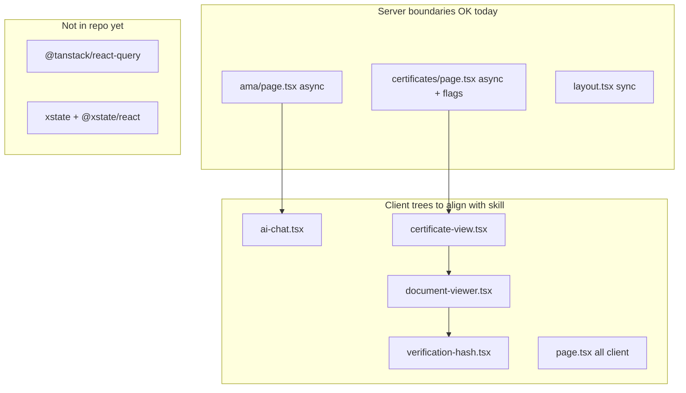

# React client expert — repo audit and roadmap (doc only)

## What the skill asks for (applied to this repo)

[`.agents/skills/react-client-expert/SKILL.md`](.agents/skills/react-client-expert/SKILL.md) governs **client** UI only:

- **No RSC for interactive logic** — server `async` pages OK for static/config (flags, disclaimers); chat, forms, PDF viewer, certificates URL state stay in `"use client"` trees.
- **Minimal `useState`** — derive during render; no sync-via-`useEffect`.
- **`useEffect` only** for subscriptions, DOM/imperative APIs, analytics — with cleanup.
- **Data** — prefer **`use(promise)` + Suspense** or **TanStack Query**; avoid `useEffect` + `fetch` + loading booleans. Repo has **neither** `@tanstack/react-query` nor **XState** today ([`package.json`](package.json)).
- **Context** — narrow, stable; memoize provider values. Only [`theme-provider.tsx`](src/components/theme-provider.tsx) uses Context today (acceptable scope, minor optimization).
- **Complex flows** — XState when multiple booleans + effects encode a state graph (strong fit: AMA chat).

Biome already aligns: `useExhaustiveDependencies` off; agents must not “fix” deps mechanically ([`biome.json`](biome.json), [`AGENTS.md`](AGENTS.md)).

---

## Current compliance snapshot

| Area | Status | Notes |
|------|--------|--------|
| Server vs client split | **Mostly OK** | [`ama/page.tsx`](src/app/ama/page.tsx), [`certificates/page.tsx`](src/app/certificates/page.tsx) are async shells; [`page.tsx`](src/app/page.tsx) is **entirely** `"use client"` (optional later split). |
| Fetch patterns | **OK for now** | No client `useEffect` fetch loaders; [`verification-hash.tsx`](src/components/verification-hash.tsx) fetches in **click handler** (fine). [`askQuestion`](src/app/actions.ts) server action from chat (fine). |
| TanStack Query / `use()` | **Not adopted** | Add when introducing shared/refetchable client data (skill § Data fetching). |
| XState | **Not adopted** | Best candidate: [`ai-chat.tsx`](src/components/ai-chat.tsx). |
| Legitimate effects | **OK** | [`content-layout.tsx`](src/app/cv/content-layout.tsx) `matchMedia`; [`document-viewer.tsx`](src/components/document-viewer.tsx) resize listener; [`sw-register.tsx`](src/components/sw-register.tsx); [`hero.tsx`](src/components/hero.tsx) particle init; [`useIntersectionObserver.ts`](src/hooks/useIntersectionObserver.ts). |
| Skill violations (priority) | **See phases below** | |

---

## Deliverable (this task)

Create **`docs/react-client-roadmap.md`** (or [`.agents/skills/react-client-expert/ROADMAP.md`](.agents/skills/react-client-expert/ROADMAP.md)) containing:

1. Link to the skill + review checklist copy.
2. File-by-file audit table (all ~24 `"use client"` modules).
3. Phased roadmap with acceptance criteria and “do not do” notes.
4. Optional dependency additions (`@tanstack/react-query`, `xstate`, `@xstate/react`) with `sfw pnpm add` and validation commands.

**No implementation** in this pass (per your choice). Link the doc from [`AGENTS.md`](AGENTS.md) skills row or Conventions one-liner.

---

## Phased roadmap (content for the MD file)

### Phase 1 — Quick wins (3–5 files, no new deps)

| File | Issue (vs skill) | Target change |
|------|------------------|---------------|
| [`verification-hash.tsx`](src/components/verification-hash.tsx) | `useEffect` loads expected hash + **second effect** derives `verificationStatus` from hashes | Static import or `useMemo` for expected hash; **`const status = deriveVerification(current, expected)`** in render; reset on `certificateId` via `key` or single effect with cleanup only for fetch abort |
| [`theme-provider.tsx`](src/components/theme-provider.tsx) | `useEffect` reads `localStorage` on mount; **unmemoized** context `value` | `useState(() => readTheme())` initializer; `useMemo(() => ({ theme, setTheme }), [theme])` for Provider |
| [`certificate-view.tsx`](src/app/certificates/certificate-view.tsx) | `useEffect` syncs URL `id` → `selectedCertificate` | Derive `selectedCertificate` from `certId` + list (with stable default); URL write in `selectCertificate` only — or `key={certId}` on viewer |
| [`ai-chat.tsx`](src/components/ai-chat.tsx) | `scrollToBottom` in deps causes pointless effect; **`messages.find` in deps** is incorrect | `useEffect` on `[messages.length]` or layout effect; fix streaming deps |
| [`ai-smart-highlight.tsx`](src/components/ai-smart-highlight.tsx) | Unused props `priority`, `aiIntensity`; mount effect for LanguageModel is OK | Remove dead props or wire them; keep single mount effect with comment |

**Exit:** `pnpm type-check`, `pnpm lint`, `pnpm test:e2e` (Brave).

### Phase 2 — AMA chat state machine (add XState)

| File | Issue | Target change |
|------|--------|---------------|
| [`ai-chat.tsx`](src/components/ai-chat.tsx) | 3× `useEffect` + `isLoading` + `streamingMessageId` + interval typing = boolean soup | Colocate `amaChatMachine.ts`; `useMachine` for idle → submitting → streaming → error; interval lives in `invoke` or `useEffect` **inside** actor setup with guaranteed cleanup |
| [`ama/page.tsx`](src/app/ama/page.tsx) | Stays async server wrapper | No change required if only disclaimer + `<AICHAT />` |

**Deps:** `xstate`, `@xstate/react` via `sfw pnpm add`.

**Exit:** E2E AMA specs still pass; manual multi-turn when `/api/cv/qa` available.

### Phase 3 — Client data layer (add TanStack Query when needed)

Introduce when a feature needs cache/refetch/invalidation (not for static [`content-hub`](src/lib/content-hub/data.ts) samples today).

| Integration | Target |
|-------------|--------|
| `QueryClientProvider` in [`layout.tsx`](src/app/layout.tsx) or a small `providers.tsx` client wrapper | One provider at root |
| Certificate hash verify | Optional `useQuery` for `/api/certificates/[id]/hash` with `enabled: false` until click, or mutation |
| Future list endpoints | `queryKey` per resource |

**Alternative (lighter):** parent passes `hashPromise` + child `use()` + Suspense — document in roadmap when one-shot read is enough.

**Deps:** `@tanstack/react-query`.

### Phase 4 — Client boundaries (optional, larger)

| File | Issue | Target change |
|------|--------|---------------|
| [`page.tsx`](src/app/page.tsx) | Whole homepage client for `motion` wrapper | Server page + client islands (`Hero`, `Header`, lazy `Projects`) to shrink JS and match “minimal client boundary” |
| [`document-viewer.tsx`](src/components/document-viewer.tsx) | `require("react-pdf")` at module scope | Dynamic `import()` + Suspense; optional **callback ref** + `ResizeObserver` instead of `querySelector` + resize (skill § Refs) |

Defer until Phase 1–2 stable.

---

## Explicitly acceptable (document as “no action”)

- [`content-layout.tsx`](src/app/cv/content-layout.tsx) — `matchMedia` subscription with teardown.
- [`document-sidebar.tsx`](src/components/document-sidebar.tsx) — read effect if only syncs external doc list.
- [`hero.tsx`](src/components/hero.tsx) — one-time particle positions on mount.
- [`ama/page.tsx`](src/app/ama/page.tsx) / [`certificates/page.tsx`](src/app/certificates/page.tsx) — async server for flags/disclaimer only.
- Local form state in [`contact.tsx`](src/components/contact.tsx), [`question-answer.tsx`](src/components/question-answer.tsx) — no fetch effect anti-pattern.

---

## What not to do (include in roadmap)

- Do not convert interactive UI to **async client components** (invalid).
- Do not add `useEffect` deps to satisfy a linter — skill + Biome policy forbid mechanical fixes.
- Do not put **messages / streaming / search** in Context.
- Do not add React Query for purely static in-memory content-hub data until there is a real API.

---

## After the MD file is written

- Add one line to [`AGENTS.md`](AGENTS.md): “Refactor backlog: [`docs/react-client-roadmap.md`](docs/react-client-roadmap.md).”
- Implementation PRs should reference phase numbers and tick checklist items from the skill § Review checklist.
