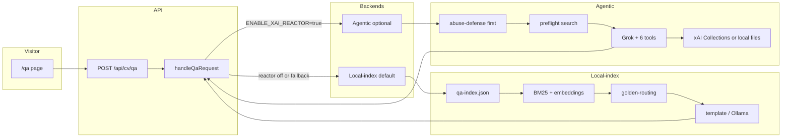

# Peramanathan Sathyamoorthy CV & Portfolio

A modern, full-stack web application showcasing Peramanathan Sathyamoorthy's professional portfolio as a Senior Software Engineer. Built with Next.js 16 App Router, featuring profile Q&A, interactive document viewing, and automated PDF CV generation.

## ✨ Features

- **💬 Profile Q&A**: Ask interview-style questions about experience, grounded in CV data and curated notes — see [Profile Q&A architecture](#-profile-qa-architecture) and [`src/lib/qa/README.md`](src/lib/qa/README.md)
- **📄 Dynamic PDF Generation**: Server-side PDF creation with professional styling
- **👁️ Interactive Document Viewer**: Inline PDF viewing with full browser integration
- **🔍 X search**: Curated X/Twitter post search by date range (`/x`; `/content-hub` redirects here — Content Hub UI removed; see [`docs/content-hub-deferred.md`](docs/content-hub-deferred.md))
- **🎨 Modern UI/UX**: Beautiful shadcn/ui components with responsive design
- **⚡ Performance Optimized**: Fast loading with Next.js App Router and Turbopack
- **♿ Accessibility**: WCAG-oriented patterns with keyboard navigation
- **🔒 Production Ready**: Cross-platform deployment support (Vercel, Netlify, AWS)
- **📱 Mobile-First**: Responsive design optimized for all device sizes

## 🛠️ Tech Stack

### Frontend
- **Next.js 16** — React framework with App Router
- **React 19** — UI library
- **TypeScript** — Type-safe JavaScript

### UI & Components
- **shadcn/ui** — Components on Radix UI
- **Radix UI** — Accessible primitives
- **Lucide React** — Icons
- **Motion** — Animation (`motion/react`)

### AI & Document Processing
- **@react-pdf/renderer** — PDF generation from React
- **react-pdf** — In-browser PDF viewing
- **@huggingface/transformers** — Local embeddings (Profile Q&A retrieval)

### Tooling
- **pnpm** — Package manager (`pnpm-lock.yaml`, workspace supply-chain policy)
- **Biome** — Lint and format (replaces ESLint for this repo)
- **Bun** — Fast runtime for PDF generation scripts
- **Playwright** — E2E tests (system **Brave Beta**, not bundled Chromium)

## 📋 Prerequisites

- **Node.js** 24+ (LTS recommended)
- **pnpm** 11+ ([Corepack](https://pnpm.io/installation): `corepack enable pnpm`)
- **Brave Beta** (or set `BRAVE_BETA_PATH`) for local E2E — see [tests/e2e/README.md](tests/e2e/README.md)
- **Bun** (optional, for `generate-pdf` script)
- **Git**

## 🚀 Installation

1. **Clone the repository**
   ```bash
   git clone <repository-url>
   cd devprofile
   ```

2. **Install dependencies**
   ```bash
   pnpm install
   ```
   For stricter supply-chain installs (recommended when changing deps), use [Socket Firewall](https://socket.dev/) or your team's wrapper, e.g. `sfw pnpm install --frozen-lockfile`. Workspace policy lives in `pnpm-workspace.yaml`.

   Optional Profile Q&A Ollama (narrative answers): copy `.env.local.example` → `.env.local`, set `OLLAMA_BASE_URL`, then restart `pnpm dev`. See [tests/qa/README.md](tests/qa/README.md).

   Optional xAI Agentic QA Reactor: see [xAI Agentic QA Reactor](#-xai-agentic-qa-reactor-optional).

3. **Sync editor profile** (optional, Cursor / VS Code)
   ```bash
   pnpm editor:sync
   ```
   Applies `.editor/profile.json` → `.vscode/settings.json`, extension recommendations, and related editor config. Install the **Biome** extension, then reload the window.

4. **Generate initial CV PDF** (optional, first deploy)
   ```bash
   pnpm run generate-pdf
   # or: bun scripts/generate-pdf.tsx
   ```

## 🏃 Development

1. **Start the dev server**
   ```bash
   pnpm dev
   ```
   - App: `http://localhost:3000`
   - Hot reload via Turbopack

2. **Useful routes**
   - Portfolio: `/`
   - CV page: `/cv`
   - Certificates: `/certificates`
   - X search: `/x` (`/content-hub` redirects here; Content Hub removed — see `docs/content-hub-deferred.md`)
   - Profile Q&A: `/qa`

   **Default `/qa` (no reactor):** uses [`src/data/qa-index.json`](src/data/qa-index.json) (git-tracked; regenerated on every `pnpm build`). For dev-only refresh: `pnpm build-qa-index`.

   - CV PDF: `/cv.pdf`

## 💬 Profile Q&A architecture

Visitors use **`/qa`** and **`POST /api/cv/qa`**. All server logic lives in [`src/lib/qa/`](src/lib/qa/) — full design, env vars, troubleshooting, and BDD tests are documented in **[`src/lib/qa/README.md`](src/lib/qa/README.md)**.

### Big picture

One JSON contract for the UI: `{ answer, details[] }`. Two backends, selected by `ENABLE_XAI_REACTOR`:



| Path | When | Retrieval | Answer |
|------|------|-----------|--------|
| **Local-index** | Default; also fallback if agentic fails or returns empty placeholder | Pre-built [`qa-index.json`](src/data/qa-index.json) (hybrid RRF) | Curated golden text, CV templates, or optional Ollama |
| **Agentic** | `ENABLE_XAI_REACTOR=true` + `XAI_API_KEY` | xAI Collections API or bundled persona files | Grok (`streamText` + tools), with preflight search and chunk synthesis if the model is silent |

**Agent skills / agents:** load [`src/lib/qa/README.md`](src/lib/qa/README.md) for module layout, production vs branch notes, and env tuning (`XAI_MODEL`, `XAI_MAX_OUTPUT_TOKENS`, etc.).

Optional xAI reactor setup: [xAI Agentic QA Reactor](#-xai-agentic-qa-reactor-optional) below.

## 📜 Available Scripts

```bash
# Development
pnpm dev              # next dev --turbopack
pnpm build            # generate PDF + SW version + production build
pnpm start            # production server

# Quality
pnpm lint             # Biome lint only (errors) — best practices, correctness, unused vars/imports
pnpm lint:report      # Biome lint — full diagnostics
pnpm lint:fix         # Biome lint --write (errors only)
pnpm format           # Biome format --write (pure formatting: indent, quotes, semicolons, etc.)
pnpm imports:fix      # Organize imports only (assist action)
pnpm type-check       # tsc --noEmit

# PDF
pnpm generate-pdf     # bun scripts/generate-pdf.tsx

# Editor profile
pnpm editor:sync      # sync .editor profile → .vscode / Cursor

# E2E (Brave Beta — see tests/e2e/README.md)
pnpm test:e2e         # all projects (desktop + mobile viewport)
pnpm test:e2e:headed  # visible Brave window
pnpm test:e2e:ui      # Playwright UI (opens Brave Beta)
pnpm test:e2e:debug   # inspector + Brave
```

**Dependency / security checks** (after lockfile changes):

```bash
pnpm audit
pnpm install
pnpm type-check && pnpm lint
```

## 🧪 End-to-end tests

E2E uses **Brave Beta** via `playwright.config.ts` / `playwright.brave.ts`, not Playwright-downloaded Chromium.

```bash
export BRAVE_BETA_PATH=/path/to/brave-browser-beta   # optional
pnpm test:e2e
```

Do **not** run `pnpm exec playwright install chromium` for day-to-day work. Remove unused Playwright browsers: `pnpm exec playwright uninstall`.

Details: [tests/e2e/README.md](tests/e2e/README.md)

## 💬 xAI Agentic QA Reactor (optional)

Agentic Profile Q&A on `/qa` using xAI Collections + Grok (flag-gated). **Default `/qa`** uses [`src/data/qa-index.json`](src/data/qa-index.json) (git-tracked, synced on `pnpm build`) when the reactor is off or on fallback.

Copy `.env.example` → `.env.local` and set:

| Variable | Required | Notes |
|----------|----------|--------|
| `XAI_API_KEY` | Yes | **Chat + Collections search** — Grok inference and `POST /v1/documents/search` ([console.x.ai](https://console.x.ai)). Enable the **documents** endpoint (or **All endpoints**) on this API key; chat-only keys get `403` on search. |
| `XAI_MANAGEMENT_API_KEY` | Optional | Management API only (create/list collections, attach files). **Not** used for search. Invalid if you paste a dead token. |
| `XAI_PROFILE_COLLECTION` | Yes | Collection **name or ID** from console.x.ai |
| `ENABLE_XAI_REACTOR` | Yes | `true` to enable the agentic path |
| `XAI_MODEL` | Recommended | e.g. `grok-4.5` / `grok-4.3` — must match a model your account can use |
| `XAI_MAX_OUTPUT_TOKENS` | Optional | Default `400` — short essence answers |
| `XAI_REASONING_EFFORT` | Optional | `low` (default) or `high` |

**Two keys, two roles:** `XAI_API_KEY` is the **API Key** for Grok **and** document search (`api.x.ai`). `XAI_MANAGEMENT_API_KEY` is only for management operations on `management-api.x.ai`. Upload/sync stays in [console.x.ai](https://console.x.ai) or an external tool — not this app.

**Collections setup:** Create a Collection and upload (or re-upload after persona edits):

| Priority | File |
|----------|------|
| Required | [`src/data/persona/ps-profile-v1.md`](src/data/persona/ps-profile-v1.md) |
| Required | [`src/data/golden-qa.md`](src/data/golden-qa.md) |
| Recommended | [`src/data/casual-qa.md`](src/data/casual-qa.md), [`src/data/top-three-achievements.md`](src/data/top-three-achievements.md) |
| Recommended | [`src/data/cvdata.json`](src/data/cvdata.json) |
| Optional | [`src/data/p10ns11y_README.md`](src/data/p10ns11y_README.md) (mirror of GitHub profile README) |

Set `XAI_PROFILE_COLLECTION` to the collection name or ID. Runtime **searches** live collection content; it does not upload.

**`/qa` UI:** Interview-desk layout — short track labels in a rail, tall composer (question + send in one field), answer stage in the primary viewport. Local golden short-circuit uses rebuilt [`src/data/qa-index.json`](src/data/qa-index.json) (`pnpm build-qa-index` / `pnpm build`).

**Development** (with keys and collection in `.env.local`):

```bash
ENABLE_XAI_REACTOR=true XAI_MODEL=grok-4.3 pnpm dev --turbopack
```

**Test production build locally** (after `pnpm build`; same vars in `.env.local`):

```bash
pnpm build
ENABLE_XAI_REACTOR=true XAI_MODEL=grok-4.3 pnpm start
```

**Deep dive:** [`src/lib/qa/README.md`](src/lib/qa/README.md) (architecture diagrams, request flows, troubleshooting, tests). Also [.env.example](.env.example), [docs/phase-1-xai-agentic-profile-qa-reactor.md](docs/phase-1-xai-agentic-profile-qa-reactor.md).

## 🤖 Agent skills (AI assistants)

Portable skills for Cursor and other coding agents live under [`.agents/skills/`](.agents/skills/). Index: [AGENTS.md](AGENTS.md) and [.agents/README.md](.agents/README.md).

| Skill | Use when |
|-------|----------|
| `fix-dependency-security` | Audit, `sfw`, supply-chain policy |
| `upgrade-packages` | Dependency upgrades and majors |
| `audit-allow-builds` | `allowBuilds` / lifecycle scripts |
| `audit-ide-dependencies` | Editor extension supply-chain |
| `project-editor-profile` | `pnpm editor:sync`, `.editor/profile.json` |
| `react-client-expert` | Client React refactors (minimal state/effects) |

## 🔧 Building for Production

```bash
pnpm build
pnpm start
```

## 🌐 Deployment

Configured for:
- **Vercel** (recommended)
- **Netlify**
- **AWS Amplify**
- Any Node.js host

### Vercel
1. Push to GitHub
2. Connect the repository
3. Deploy on push (use `pnpm install` / `pnpm build` in project settings)

## 📚 Documentation

- **[src/lib/qa/README.md](src/lib/qa/README.md)** — Profile Q&A library: dual-path architecture, env vars, production troubleshooting, BDD tests
- **[ARCHITECTURE.md](ARCHITECTURE.md)** — App structure and customization
- **[docs/vercel-err-require-esm-next-16.2.md](docs/vercel-err-require-esm-next-16.2.md)** — Vercel `ERR_REQUIRE_ESM` on Next 16.2
- **[CONTRIBUTING.md](CONTRIBUTING.md)** — Branching, Biome, React client guidelines, E2E
- **[CHANGELOG.md](CHANGELOG.md)** — Version history
- **[AGENTS.md](AGENTS.md)** — Agent conventions and Playwright notes
- **[tests/e2e/README.md](tests/e2e/README.md)** — Brave Beta, headed/UI/debug modes

## 📄 License

This project is private and proprietary.

## 📞 Support

For questions or issues:
- Review the code and docs above
- See [AGENTS.md](AGENTS.md) and [.agents/README.md](.agents/README.md) for agent-oriented conventions
- Contact Peramanathan Sathyamoorthy directly

---

**Built with Next.js 16 & React 19**
