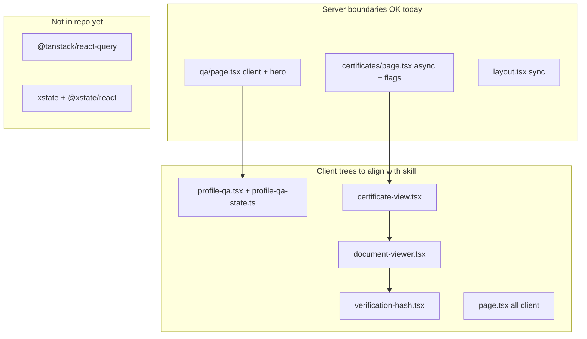

# React client roadmap

Living backlog for aligning client UI with [react-client-expert](../.agents/skills/react-client-expert/SKILL.md). Implementation PRs should reference phase numbers and tick items from the skill **Review checklist**.

## Skill reference

| Topic | Rule |
|-------|------|
| Scope | `"use client"` trees only — no async client components; server `async` pages OK for static shells |
| State | Derive during render; minimal `useState`; no sync-via-`useEffect` |
| Effects | Subscriptions, DOM/imperative APIs, analytics — with cleanup |
| Data | `use(promise)` + Suspense or TanStack Query — not `useEffect` + fetch + booleans |
| Context | Narrow, stable values; memoize provider objects |
| Complex flows | XState when boolean + effect soup (only if `useReducer` is insufficient) |

**Lint:** Biome `useExhaustiveDependencies` is off — do not mechanically widen effect deps ([`biome.json`](../biome.json), [`AGENTS.md`](../AGENTS.md)).

## Architecture snapshot



## Compliance snapshot

| Area | Status | Notes |
|------|--------|--------|
| Server vs client split | **Mostly OK** | [`qa/page.tsx`](../src/app/qa/page.tsx) client page with hero + [`ProfileQA`](../src/components/profile-qa.tsx); [`certificates/page.tsx`](../src/app/certificates/page.tsx) async shell; [`page.tsx`](../src/app/page.tsx) entirely client (optional later split). |
| Fetch patterns | **OK** | Profile Q&A: `fetch` in event handler via [`profile-qa-state.ts`](../src/components/profile-qa-state.ts) → `POST /api/cv/qa`. [`verification-hash.tsx`](../src/components/verification-hash.tsx) fetches on click. |
| TanStack Query / `use()` | **Not adopted** | Add when shared/refetchable client data appears. |
| XState | **Not adopted** | Profile Q&A uses `useReducer` today; XState only if flow complexity grows. |
| Legitimate effects | **OK** | [`content-layout.tsx`](../src/app/cv/content-layout.tsx) `matchMedia`; [`document-viewer.tsx`](../src/components/document-viewer.tsx) resize; [`sw-register.tsx`](../src/components/sw-register.tsx); [`hero.tsx`](../src/components/hero.tsx); [`useIntersectionObserver.ts`](../src/hooks/useIntersectionObserver.ts). |

## Client module audit (`"use client"`)

| Module | Phase | Notes |
|--------|-------|--------|
| `app/page.tsx` | 4 | Whole homepage client for motion — optional server + islands |
| `app/qa/page.tsx` | — | Page hero + `ProfileQA` |
| `app/certificates/page.tsx` | — | Async server + flags |
| `app/certificates/certificate-view.tsx` | 1 ✅ | URL → selection derived (CHANGELOG) |
| `app/cv/page.tsx` | — | Dynamic layout import |
| `app/cv/content-layout.tsx` | — | `matchMedia` subscription OK |
| `app/cv/view/page.tsx` | — | `next/dynamic` for `@react-pdf/renderer` |
| `app/accomplishments/page.tsx` | — | Redirect to `/#accomplishments` |
| ~~`app/content-hub/[page]/page.tsx`~~ | — | **Removed** — see `docs/content-hub-deferred.md` |
| `app/master-thesis.pdf/page.tsx` | — | PDF route |
| `components/profile-qa.tsx` | 1 ✅ | `useReducer` + submit-on-click (no effect fetch) |
| `components/profile-qa-state.ts` | 1 ✅ | QA status enum + `fetchQaAnswer` |
| `components/ai-smart-highlight.tsx` | 1 ✅ | Dead props removed |
| `components/document-viewer.tsx` | 4 ✅ | Dynamic `react-pdf` chunk + Suspense |
| `components/document-sidebar.tsx` | — | Sidebar selection |
| `components/verification-hash.tsx` | 1 ✅ | Derived verification status |
| `components/theme-provider.tsx` | 1 ✅ | `useSyncExternalStore` + memoized context |
| `components/theme-toggle.tsx` | — | Uses theme context |
| `components/hero.tsx` | 1 ✅ | CSS gradient mesh; no particle useEffect |
| `components/sw-register.tsx` | — | SW registration OK |
| `components/contact.tsx` | — | Local form state OK |
| `components/header.tsx` | — | Presentation |
| `components/projects.tsx` | — | Presentation |
| `components/experience.tsx` | — | Presentation |
| `components/accomplishments.tsx` | — | Presentation |
| `components/timeline.tsx` | — | Presentation |
| ~~`components/content-hub/*`~~ | — | **Removed** — deferred; see `docs/content-hub-deferred.md` |

Modules without `"use client"` that wrap client children (e.g. `certificates/page.tsx`) are listed under server OK above.

## Phased roadmap

### Phase 1 — Quick wins (no new deps) — **Done** ([CHANGELOG](../CHANGELOG.md) § React client phase 1)

| File | Target | Status |
|------|--------|--------|
| `verification-hash.tsx` | Derive status in render; `certificateId` via `key` | ✅ Done |
| `theme-provider.tsx` | `useSyncExternalStore` + memoized context | ✅ Done |
| `certificate-view.tsx` | Derive selection from URL `id` | ✅ Done |
| `profile-qa.tsx` / `profile-qa-state.ts` | `useReducer` + handler fetch (no effect loader) | ✅ Done |
| `ai-smart-highlight.tsx` | Remove unused props | ✅ Done |

**Exit criteria:** `pnpm type-check`, `pnpm lint`, `pnpm test:e2e` (Brave).

### Phase 2 — Profile Q&A polish (optional XState)

| File | Issue | Target change |
|------|--------|---------------|
| `profile-qa-state.ts` | Single reducer covers idle/loading/success/error | Keep unless multi-step flows appear (follow-ups, streaming) |
| `profile-qa.tsx` | Presentation only | No change unless splitting islands |

**Deps:** `xstate`, `@xstate/react` only if reducer model becomes insufficient.

**Exit:** E2E [`tests/e2e/qa.spec.ts`](../tests/e2e/qa.spec.ts); manual checks when `OLLAMA_BASE_URL` set.

### Phase 3 — Client data layer (TanStack Query when needed)

| Integration | Target |
|-------------|--------|
| `QueryClientProvider` in `layout.tsx` or `providers.tsx` | One root provider |
| Certificate hash verify | Optional `useQuery` / mutation for `/api/certificates/[id]/hash` |
| Future APIs | `queryKey` per resource |

**Lighter alternative:** parent passes `hashPromise` + child `use()` + Suspense for one-shot reads.

**Deps:** `@tanstack/react-query`.

### Phase 4 — Client boundaries (optional, larger)

| File | Issue | Target change | Status |
|------|--------|---------------|--------|
| `page.tsx` | Entire homepage client | Server page + client islands (`Hero`, `Header`, lazy `Projects`) | Pending |
| `document-viewer.tsx` | Module-scope `require("react-pdf")` | `next/dynamic` + Suspense; optional ResizeObserver vs `querySelector` | ✅ Done |

Defer homepage split until needed.

## Explicitly acceptable (no action)

- `content-layout.tsx` — `matchMedia` with teardown
- `document-sidebar.tsx` — external doc list sync if present
- `hero.tsx` — one-time particle positions on mount
- `certificates/page.tsx` — async server for flags/disclaimer only
- Local form state in `contact.tsx`, `profile-qa.tsx` submit handlers

## What not to do

- Do not use **async client components** for interactive UI.
- Do not widen `useEffect` deps to satisfy linters — fix the model.
- Do not put messages / streaming / search in Context.
- Do not add React Query for static hub data until there is a real API (Content Hub removed — see `docs/content-hub-deferred.md`).

## Optional dependencies

When adding packages:

```bash
sfw pnpm add @tanstack/react-query   # phase 3
sfw pnpm add xstate @xstate/react    # phase 2 (only if needed)
pnpm install
pnpm type-check && pnpm lint
```

## Review checklist (from skill)

- [ ] Client boundary minimal — server shells where possible
- [ ] No sync state via `useEffect`
- [ ] Effects have cleanup where needed
- [ ] Data via Query or `use()` + Suspense, not effect fetch soup
- [ ] Context values memoized; no wide app state in Context
- [ ] Complex flows use XState when boolean soup appears
