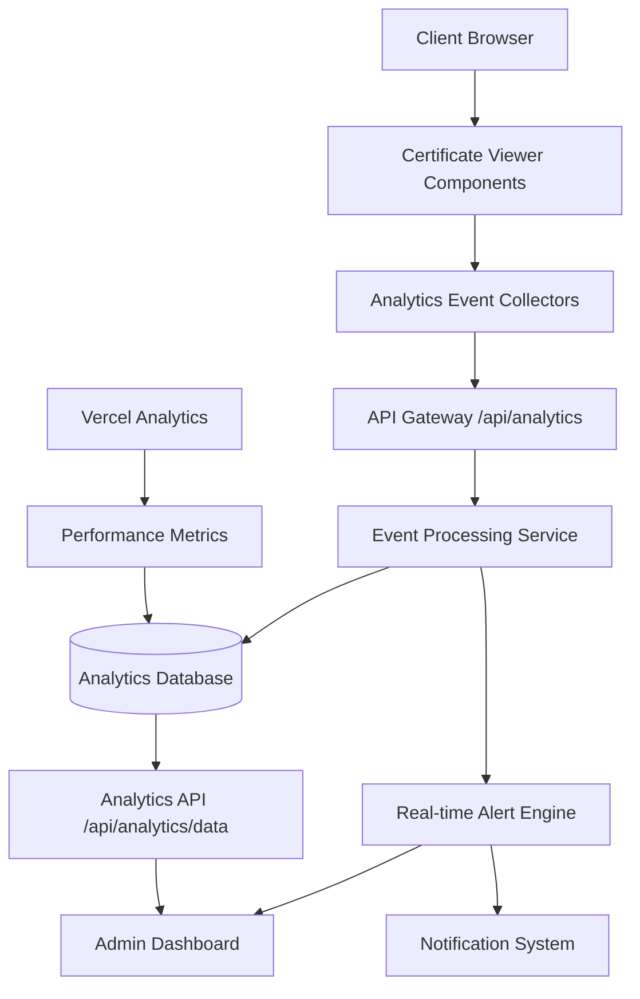
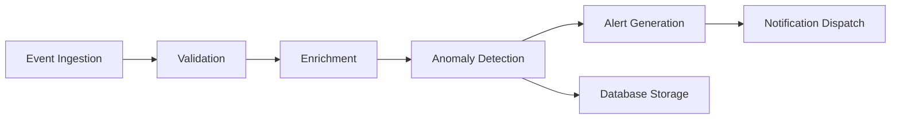

# Intelli Insights - Advanced User Analytics & Tracking System

## Technical Specification Document

### 1. System Architecture Overview

#### High-Level Architecture Diagram



#### Architecture Components

- **Client-Side Collectors**: JavaScript modules integrated into certificate viewing components
- **API Layer**: Next.js API routes for event ingestion and data retrieval
- **Processing Layer**: Server-side event validation, enrichment, and anomaly detection
- **Storage Layer**: Secure, encrypted database for analytics data
- **Real-time Engine**: WebSocket-based alert system for suspicious activity
- **Admin Interface**: Protected dashboard for monitoring and configuration

#### Performance Requirements
- <5% performance impact on page load times
- Event processing latency <100ms
- Database query response <500ms for analytics data
- Real-time alerts delivered within 5 seconds of detection

### 2. Data Models

#### Core Analytics Event Interface

```typescript
interface AnalyticsEvent {
  id: string; // UUID
  eventType: 'view' | 'download' | 'right_click' | 'screenshot_attempt' | 'navigation' | 'session_start' | 'session_end';
  certificateId: string;
  timestamp: number; // Unix timestamp in milliseconds
  sessionId: string; // UUID for user session
  userId?: string; // Optional, anonymized user identifier
  deviceInfo: {
    os: string;
    browser: string;
    screenSize: string;
    userAgent: string;
    language: string;
  };
  location: {
    country: string;
    region: string; // Anonymized region
    timezone: string;
  };
  interactionData: {
    duration?: number; // View duration in milliseconds
    referrer?: string;
    pageUrl: string;
    viewportSize: string;
    scrollDepth?: number;
  };
  securityFlags: {
    isSuspicious: boolean;
    riskScore: number; // 0-100
    flags: string[]; // e.g., ['multiple_downloads', 'rapid_navigation']
  };
  consentStatus: {
    analytics: boolean;
    marketing: boolean;
    timestamp: number;
  };
}
```

#### Extended Event Types

```typescript
interface ViewEvent extends AnalyticsEvent {
  eventType: 'view';
  interactionData: {
    duration: number;
    scrollDepth: number;
    zoomLevel?: number;
  };
}

interface DownloadEvent extends AnalyticsEvent {
  eventType: 'download';
  interactionData: {
    fileSize: number;
    downloadMethod: 'direct' | 'context_menu' | 'programmatic';
    success: boolean;
  };
}

interface RightClickEvent extends AnalyticsEvent {
  eventType: 'right_click';
  interactionData: {
    targetElement: string; // e.g., 'certificate_viewer', 'sidebar'
    contextMenuItems?: string[];
  };
}

interface ScreenshotEvent extends AnalyticsEvent {
  eventType: 'screenshot_attempt';
  interactionData: {
    method: 'keyboard' | 'dev_tools' | 'canvas_manipulation';
    canvasSize?: string;
  };
}
```

#### Session Data Model

```typescript
interface UserSession {
  sessionId: string;
  startTime: number;
  endTime?: number;
  duration?: number;
  events: AnalyticsEvent[];
  deviceFingerprint: string; // Hashed device identifier
  ipHash: string; // Anonymized IP hash
  consentGiven: boolean;
  lastActivity: number;
}
```

### 3. API Design

#### Event Logging API

**Endpoint**: `POST /api/analytics/events`

**Request Body**:
```json
{
  "events": [AnalyticsEvent],
  "sessionId": "string",
  "clientVersion": "string"
}
```

**Response**:
```json
{
  "success": true,
  "processed": 5,
  "errors": []
}
```

**Rate Limiting**: 100 events per minute per IP

**Authentication**: API key for server-side logging, consent token for client-side

#### Analytics Data Retrieval API

**Endpoint**: `GET /api/analytics/data`

**Query Parameters**:
- `startDate`: ISO date string
- `endDate`: ISO date string
- `eventType`: string (optional)
- `certificateId`: string (optional)
- `limit`: number (default 1000)
- `offset`: number (default 0)

**Response**:
```json
{
  "data": [AnalyticsEvent],
  "total": 15000,
  "hasMore": true
}
```

**Authentication**: Admin JWT token required

#### Real-time Alert Subscription API

**Endpoint**: `GET /api/analytics/alerts/stream`

**Response**: Server-Sent Events stream

**Authentication**: Admin JWT token

### 4. Database Schema Design

#### Events Table

```sql
CREATE TABLE analytics_events (
  id UUID PRIMARY KEY DEFAULT gen_random_uuid(),
  event_type VARCHAR(50) NOT NULL,
  certificate_id VARCHAR(100) NOT NULL,
  timestamp TIMESTAMPTZ NOT NULL,
  session_id UUID NOT NULL,
  user_id VARCHAR(255),
  device_info JSONB NOT NULL,
  location JSONB NOT NULL,
  interaction_data JSONB,
  security_flags JSONB NOT NULL,
  consent_status JSONB NOT NULL,
  created_at TIMESTAMPTZ DEFAULT NOW(),
  updated_at TIMESTAMPTZ DEFAULT NOW()
);

-- Indexes
CREATE INDEX idx_events_timestamp ON analytics_events (timestamp);
CREATE INDEX idx_events_session ON analytics_events (session_id);
CREATE INDEX idx_events_certificate ON analytics_events (certificate_id);
CREATE INDEX idx_events_type ON analytics_events (event_type);
CREATE INDEX idx_events_security ON analytics_events (security_flags);
```

#### Sessions Table

```sql
CREATE TABLE user_sessions (
  session_id UUID PRIMARY KEY,
  start_time TIMESTAMPTZ NOT NULL,
  end_time TIMESTAMPTZ,
  duration INTEGER,
  device_fingerprint VARCHAR(255) NOT NULL,
  ip_hash VARCHAR(255) NOT NULL,
  consent_given BOOLEAN DEFAULT false,
  last_activity TIMESTAMPTZ NOT NULL,
  created_at TIMESTAMPTZ DEFAULT NOW()
);
```

#### Alert Rules Table

```sql
CREATE TABLE alert_rules (
  id UUID PRIMARY KEY DEFAULT gen_random_uuid(),
  name VARCHAR(255) NOT NULL,
  description TEXT,
  conditions JSONB NOT NULL,
  severity VARCHAR(20) NOT NULL, -- 'low', 'medium', 'high', 'critical'
  enabled BOOLEAN DEFAULT true,
  created_at TIMESTAMPTZ DEFAULT NOW()
);
```

#### Security Considerations for Database

- **Encryption**: All data encrypted at rest using AES-256
- **Access Control**: Row-level security policies
- **Audit Logging**: All queries logged for compliance
- **Data Retention**: Automatic deletion after configurable periods (30/90/365 days)
- **Backup**: Encrypted backups with geographic replication

### 5. Integration Points with Certificate Viewing Components

#### Certificate View Component (`certificate-view.tsx`)

**Integration Points**:
- Session initialization on component mount
- Event logging for certificate selection changes
- View duration tracking with visibility API
- Navigation pattern tracking

**Code Integration**:
```typescript
useEffect(() => {
  // Initialize session
  const sessionId = initializeAnalyticsSession();
  
  // Track view event
  logAnalyticsEvent({
    eventType: 'view',
    certificateId: selectedCertificate.id,
    sessionId,
    // ... other data
  });
}, [selectedCertificate]);
```

#### Document Viewer Component (`DocumentViewer`)

**Integration Points**:
- Right-click event detection
- Download attempt monitoring
- Screenshot detection (keyboard shortcuts, canvas manipulation)
- Scroll depth and interaction tracking

**Event Listeners**:
```typescript
useEffect(() => {
  const handleContextMenu = (e) => {
    logAnalyticsEvent({
      eventType: 'right_click',
      certificateId: document.id,
      interactionData: { targetElement: e.target.tagName }
    });
  };

  const handleKeyDown = (e) => {
    if ((e.ctrlKey || e.metaKey) && e.key === 's') {
      logAnalyticsEvent({
        eventType: 'screenshot_attempt',
        method: 'keyboard'
      });
    }
  };

  document.addEventListener('contextmenu', handleContextMenu);
  document.addEventListener('keydown', handleKeyDown);
  
  return () => {
    document.removeEventListener('contextmenu', handleContextMenu);
    document.removeEventListener('keydown', handleKeyDown);
  };
}, [document]);
```

#### Document Sidebar Component (`DocumentSidebar`)

**Integration Points**:
- Navigation pattern tracking
- Selection event logging
- User journey analytics

### 6. Privacy and Security Considerations

#### GDPR Compliance Framework

**Legal Basis**:
- Consent for analytics tracking
- Legitimate interest for security monitoring
- Data minimization principles

**Consent Management**:
```typescript
interface ConsentSettings {
  analytics: boolean;
  marketing: boolean;
  security: boolean;
  timestamp: number;
  version: string;
}
```

**Opt-out Mechanisms**:
- Cookie-based preferences
- URL parameter opt-out (?analytics=off)
- Browser Do Not Track support
- Global privacy settings page

#### Data Anonymization

**Anonymization Techniques**:
- IP address hashing with salt rotation
- Geographic data limited to country/region
- Device fingerprinting using non-PII attributes
- Session-based user identification

**PII Handling**:
- No collection of names, emails, or personal identifiers
- Automatic data masking for sensitive fields
- Secure deletion workflows

#### Security Measures

**Input Validation**:
- Schema validation for all event data
- Rate limiting per IP and session
- Content Security Policy headers

**Access Controls**:
- JWT-based authentication for admin APIs
- Role-based permissions (admin, analyst, auditor)
- API key rotation and monitoring

**Encryption**:
- TLS 1.3 for all data in transit
- AES-256-GCM for data at rest
- Secure key management with HSM

### 7. Real-time Processing and Alert System Design

#### Event Processing Pipeline



#### Anomaly Detection Rules

**Suspicious Activity Patterns**:
- Multiple downloads from same IP within short time
- Rapid navigation through multiple certificates
- Screenshot attempts combined with downloads
- Unusual geographic patterns
- High-frequency right-click events

**Risk Scoring Algorithm**:
```typescript
function calculateRiskScore(event: AnalyticsEvent, session: UserSession): number {
  let score = 0;
  
  // Download frequency
  if (event.eventType === 'download') {
    const recentDownloads = getRecentEvents(session.sessionId, 'download', 300000); // 5 min
    score += Math.min(recentDownloads.length * 10, 40);
  }
  
  // Screenshot attempts
  if (event.eventType === 'screenshot_attempt') {
    score += 30;
  }
  
  // Geographic anomalies
  if (isGeographicAnomaly(event.location, session)) {
    score += 20;
  }
  
  return Math.min(score, 100);
}
```

#### Alert System Architecture

**Alert Types**:
- **Real-time**: Immediate notifications for high-risk activities
- **Batch**: Daily/weekly summaries of suspicious patterns
- **Threshold**: Alerts when metrics exceed predefined limits

**Notification Channels**:
- Email notifications to security team
- Slack/Discord webhooks
- SMS for critical alerts
- Dashboard alerts with severity levels

**Alert Escalation**:
- Low: Logged only
- Medium: Email notification
- High: SMS + email + dashboard alert
- Critical: All channels + automated response

#### Real-time Implementation

**Technology Stack**:
- WebSockets for real-time event streaming
- Redis for temporary event buffering
- PostgreSQL with LISTEN/NOTIFY for database triggers
- Node.js workers for event processing

**Performance Optimization**:
- Event batching for high-volume scenarios
- Horizontal scaling with load balancers
- Caching layer for frequently accessed data
- Asynchronous processing to maintain <5% performance impact

---

This specification provides a comprehensive blueprint for implementing the Intelli Insights analytics system. The design ensures scalability, security, and compliance while maintaining minimal performance impact on the existing certificate viewing functionality.