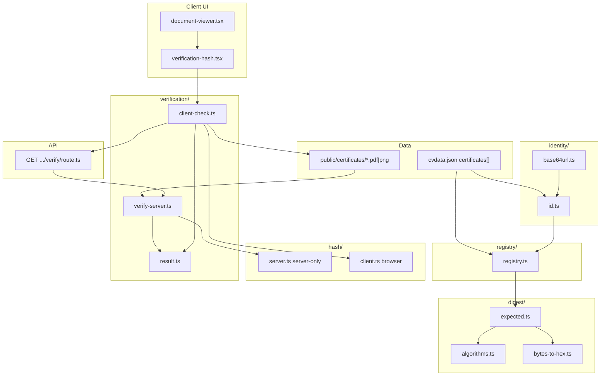
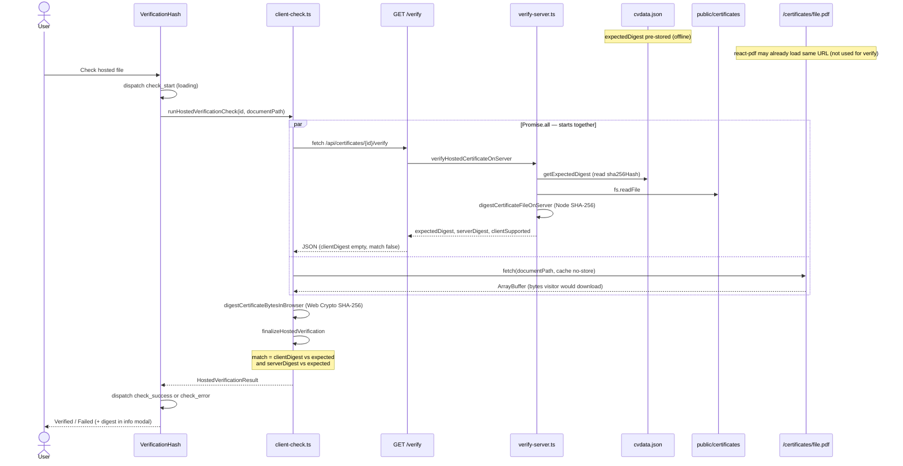
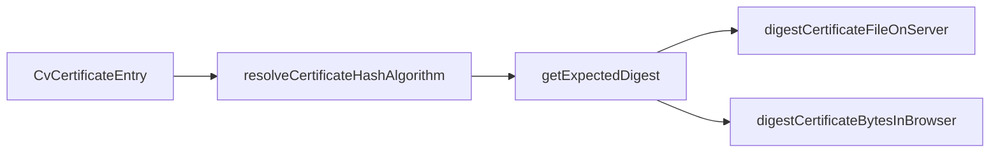
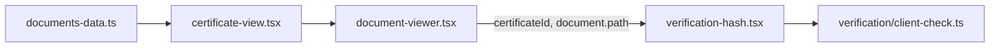

# `@/lib/certificates` — Hosted certificate verification

Self-contained library for certificate **identity**, **visibility**, **published digests**, and **hosted-file verification** (server + browser). Expected digests live in `cvdata.json` and are never shipped in the client bundle for verification UI.

**Entry points**

| Surface | Role |
|---------|------|
| `@/lib/certificates` | **Client-safe** barrel (UI, registry, browser verify) |
| `@/lib/certificates/server` | **Server-only** barrel (API route, Node scripts that hash on disk) |
| `GET /api/certificates/[id]/verify` | Server verify → `verifyHostedCertificateOnServer` |
| `VerificationHash` (`src/components/verification-hash.tsx`) | UI → `runHostedVerificationCheck` |
| `getCertificatesData()` (`src/data/documents-data.ts`) | Grid/modal docs → registry + `certificateIdFromFilename` |
| `pnpm validate-certificates` | CI: ids, files on disk, digest match |

---

## Folder map

```
lib/certificates/
├── README.md                 ← you are here
├── index.ts                  ← client-safe exports (no server-only)
├── server.ts                 ← server-only re-exports (API, fs digest)
├── identity/
│   ├── id.ts                 ← base64url ids, cvdata lookup
│   └── base64url.ts          ← browser-safe encode/decode
├── registry/
│   └── registry.ts           ← hidden certs, allowlist paths, visible lists
├── digest/
│   ├── algorithms.ts         ← sha256 | blake3 registry metadata
│   ├── expected.ts           ← read sha256Hash / blake3Hash from cvdata
│   └── bytes-to-hex.ts       ← hex + constant-time compare helpers
├── hash/
│   ├── server.ts             ← Node providers (server-only)
│   └── client.ts             ← Web Crypto providers (browser)
└── verification/
    ├── result.ts             ← HostedVerificationResult + match logic
    ├── verify-server.ts      ← fs read + server digest (server-only)
    └── client-check.ts       ← parallel fetch + browser digest
```

Colocated tests: `**/*.test.ts` beside each module (same pattern as `@/lib/qa`).

---

## Architecture



### Design principles

1. **Expected digest stays server-side for UI** — the verify API returns `expectedDigest`; the client bundle does not import `cvdata.json` for hashes.
2. **Bijective ids** — `certificateIdFromFilename` = base64url(utf8 filename); no sanitized slugs (avoids collisions).
3. **Hidden certs are invisible** — registry filters Polaris / human-trafficking templates; API returns 404 for their ids.
4. **Triple match for “verified”** — `clientDigest`, `serverDigest`, and `expectedDigest` must all agree (see `hostedVerificationMatches`).
5. **Parallel client I/O** — `runHostedVerificationCheck` uses `Promise.all` for `/verify` and `/certificates/...` (no sequential waterfall).

---

## Trust model

What “Check hosted file” means for the visitor:

| Check | Source | Proves |
|-------|--------|--------|
| `expectedDigest` | `cvdata.json` via API | What this site publishes as official |
| `serverDigest` | `fs.readFile` on server | On-disk file under `public/certificates/` matches publish |
| `clientDigest` | `fetch(document.path)` + Web Crypto | Bytes at the **same URL as the PDF viewer** match publish |

### Three digest values (two live hashes per click)

There are **three digest strings** in the model, but only **two SHA-256 computations** run when someone clicks **Check hosted file**:

| # | Field | What it is | When it is computed |
|---|--------|------------|---------------------|
| 1 | `expectedDigest` | `sha256Hash` (or algorithm-specific field) in `cvdata.json` | **Offline** — `scripts/calculate-hashes.ts` or CI (`pnpm validate-certificates`). On verify, the server **reads** this value; it does not re-hash disk into cvdata on every click. |
| 2 | `serverDigest` | Hash of `public/certificates/{filename}` on disk | **Each `GET /verify`** — Node reads the file and runs `digestCertificateFileOnServer`. |
| 3 | `clientDigest` | Hash of bytes returned by `fetch(document.path)` | **Each check** — browser `crypto.subtle.digest` via `digestCertificateBytesInBrowser`. |

So: one **stored** fingerprint you publish, plus **two fresh hashes** (server + browser) at runtime.

### When the UI shows “verified”

`match` is true only when **both** runtime digests equal the published one (`verification/result.ts` → `hostedVerificationMatches`):

```ts
clientDigest === expectedDigest && serverDigest === expectedDigest
```

| Flag | Meaning |
|------|---------|
| `serverMatchesExpected` | Deployed file on disk still matches what you published |
| `clientMatchesExpected` | Bytes at the hosted URL still match what you published |
| `match` | Both of the above (full triple agreement) |

We do **not** compare `clientDigest` to `serverDigest` as a separate rule; if both match `expectedDigest`, they match each other.

### Runtime sequence (one click)

Code path: `VerificationHash` → `runHostedVerificationCheck` (`verification/client-check.ts`) → `finalizeHostedVerification` (`verification/result.ts`).



| Step | Module | What happens |
|------|--------|----------------|
| 1 | `verification-hash.tsx` | Button → `check_start`, call `runHostedVerificationCheck` |
| 2 | `client-check.ts` | `Promise.all`: `/verify` + `fetch(document.path)` in parallel |
| 3 | `verify-server.ts` | Read published digest from cvdata; hash on-disk file → `serverDigest` |
| 4 | `client-check.ts` | After both complete: hash `ArrayBuffer` → `clientDigest` |
| 5 | `result.ts` | `finalizeHostedVerification` sets `match` when client **and** server equal `expectedDigest` |
| 6 | `verification-hash.tsx` | `deriveVerificationStatus` → shield UI |

**Common diagram mistake:** showing `GET /verify` finish first, then a separate browser-only `par` for fetch + SHA-256. In code, **fetch of the PDF starts at the same time as `/verify`**, not after the API returns. Hashing in the browser runs only after **both** responses are back (needs `algorithm` + bytes).

### What we do not do on click

- **Recompute cvdata on the server** — `/verify` treats `cvdata.json` as the published source of truth and compares live server/browser digests **to that**.
- **Hash the PDF viewer’s in-memory bytes** — react-pdf may already have loaded the file; verify uses its own `fetch` so the digest is exactly what HTTP returns at `document.path` (with `cache: "no-store"`).

### Offline / ops (keeping `expectedDigest` correct)

| Command | Role |
|---------|------|
| `scripts/calculate-hashes.ts` | Rewrite `sha256Hash` in `cvdata.json` from files on disk after add/replace PDFs |
| `pnpm validate-certificates` | CI guard: unique ids, files exist, on-disk SHA-256 matches cvdata |

**Not verified by the button:** a file the user downloaded earlier to disk — offline steps are documented in the info modal (`certutil` / `shasum` / `sha256sum`).

---

## Certificate identity

| Function | Purpose |
|----------|---------|
| `certificateIdFromFilename(name)` | URL/query id, e.g. `JustJavaScript-certificate.pdf` → `SnVzdEphdmFTY3JpcHQtY2VydGlmaWNhdGUucGRm` |
| `filenameFromCertificateId(id)` | Decode + allowlist check + round-trip guard |
| `findCertificateById` / `findCertificateByFilename` | Lookup in `cvdata.json` |

**Why `base64url.ts` exists:** Next’s client `Buffer` polyfill does not support `encoding: "base64url"`. Identity encoding uses `TextEncoder` + `btoa`/`atob` so ids work in the browser and Node.

**Bookmark break:** old `?id=cert-*` sanitized ids are intentionally unsupported.

---

## Registry (visibility + path safety)

| Function | Purpose |
|----------|---------|
| `isHiddenCertificate(filename)` | Filename blocklist + course title matching `/human trafficking/i` |
| `findVisibleCertificateById` | Lookup + hidden filter (API + UI) |
| `listVisibleCertificates` | Certificates grid data source |
| `visibleCertificateIds` | Modal `?id=` allowlist |
| `assertCertificateFilename` | Basename only, no `..`, charset allowlist |
| `certificateFilePath` | `public/certificates/{filename}` relative path |

---

## Digest pipeline



| Module | Runtime |
|--------|---------|
| `digest/algorithms.ts` | Shared — algorithm id + labels |
| `digest/expected.ts` | Shared — maps `sha256Hash` / `blake3Hash` fields |
| `hash/server.ts` | **server-only** — Node `crypto.createHash` (+ extensible providers) |
| `hash/client.ts` | **browser** — `crypto.subtle.digest` (+ extensible providers) |

### Adding BLAKE3 (or another algorithm)

1. Add hash field(s) on certificates in `cvdata.json` and set `hashAlgorithm` if not sha256.
2. `registerServerHashProvider` in `hash/server.ts` (or at app bootstrap).
3. `registerClientHashProvider` in `hash/client.ts` (e.g. WASM).
4. Append id to `CLIENT_HASH_ALGORITHM_IDS` in `digest/algorithms.ts`.
5. Extend `scripts/validate-certificates.mjs` to hash-check the new algorithm.

---

## Verification API

**Route:** `src/app/api/certificates/[id]/verify/route.ts`

| Status | Meaning |
|--------|---------|
| `200` | Visible cert, digest configured, payload returned |
| `404` | Unknown id or hidden cert |
| `400` | Invalid id string |
| `501` | Algorithm not configured on server |

Response shape (`HostedVerificationResult` partial — `clientDigest` empty until browser runs):

```json
{
  "certificateId": "SnVzdEphdmFTY3JpcHQtY2VydGlmaWNhdGUucGRm",
  "filename": "JustJavaScript-certificate.pdf",
  "algorithm": "sha256",
  "expectedDigest": "<from cvdata>",
  "serverDigest": "<sha256 of file on disk>",
  "serverMatchesExpected": true,
  "clientSupported": true,
  "match": false,
  "algorithmLabel": "SHA-256",
  "timestamp": "..."
}
```

---

## Client UI wiring



`VerificationHash` state machine: `useReducer` with `idle | loading | success | error`; `AbortController` on repeat clicks and unmount.

---

## Ops scripts

| Script | Uses |
|--------|------|
| `pnpm validate-certificates` | `scripts/validate-certificates.mjs` — duplicate ids, missing files, sha256 vs cvdata |
| `scripts/calculate-hashes.ts` | Rewrites `sha256Hash` in `cvdata.json` from disk (run after adding/changing PDFs) |

**Import split (required):** Client components must use `@/lib/certificates` only — never `@/lib/certificates/server`. The API route uses `@/lib/certificates/server` for `verifyHostedCertificateOnServer`. Plain `node` scripts can use subpaths (`digest/bytes-to-hex`, `identity/id`) or `@/lib/certificates/server` when run under Next; for standalone `node scripts/calculate-hashes.ts`, prefer subpaths to avoid the `server-only` package guard.

---

## Tests

```bash
pnpm test:certificates
```

Runs `src/lib/certificates/**/*.test.ts` and `src/app/api/certificates/**/route.test.ts`. Vitest stubs `server-only` via `vitest.config.ts` for `verify-server` integration tests.

| Test file | Covers |
|-----------|--------|
| `identity/id.test.ts` | Id round-trip, collision regression |
| `identity/base64url.test.ts` | Browser-safe encoding vs Node |
| `registry/registry.test.ts` | Hidden vs visible lookup |
| `verification/result.test.ts` | Match / finalize logic |
| `verification/client-check.test.ts` | Parallel fetch, errors |
| `src/app/api/certificates/[id]/verify/route.test.ts` | HTTP 404/200 (mocked server) |

---

## Related files outside this package

| Path | Relationship |
|------|----------------|
| `src/data/cvdata.json` | Source of truth for filenames, digests, course metadata |
| `public/certificates/` | Static files served at `/certificates/{filename}` |
| `.cursor/plans/fix_cert_hash_verify_65e2585c.plan.md` | Original implementation plan |

---

## Quick debugging

| Symptom | Likely cause |
|---------|----------------|
| Page crash `Unknown encoding: base64url` | Importing Node `Buffer` base64url on client — use `identity/base64url.ts` only |
| `404` on verify for known file | Hidden cert, missing `sha256Hash`, or wrong id (old `cert-*` slug) |
| Verified on API but fails in UI | CDN/cache serving different bytes than disk — check `serverDigest` vs `clientDigest` in modal |
| Two PDF requests in Network | react-pdf load + verification `fetch` (expected unless viewer bytes are reused later) |
