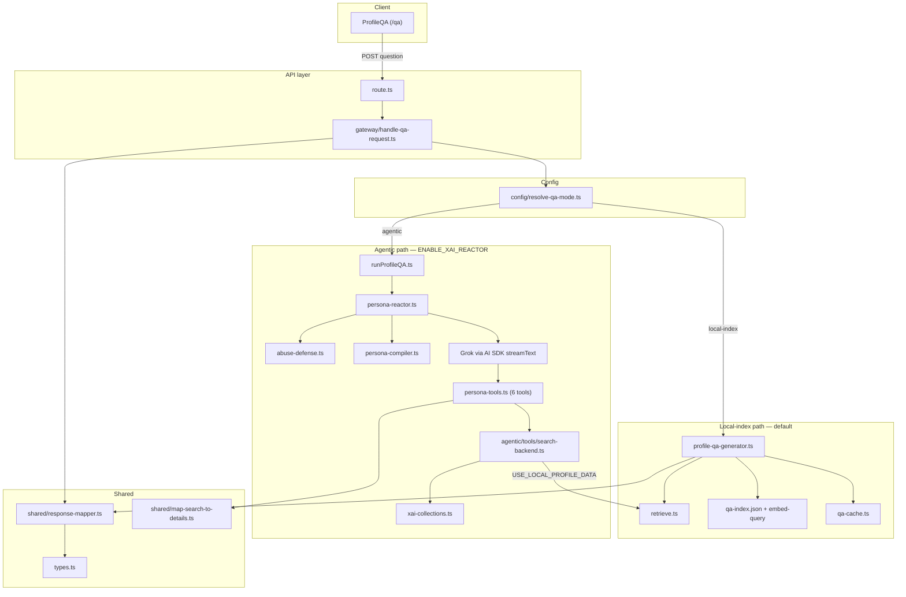
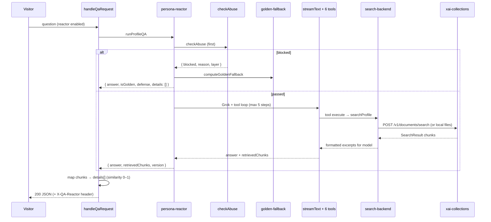

# `@devprofile/qa` — Profile Q&A

Self-contained server library for the `/qa` page: two retrieval backends behind one HTTP contract, BDD-first tests, and a single visitor-facing JSON shape.

**Entry points**

| Surface | Role |
|---------|------|
| `POST /api/cv/qa` | Thin route → `handleQaRequest` |
| `@/lib/qa` | Public barrel (gateway, config, types, tools) |
| `ProfileQA` (`src/components/profile-qa.tsx`) | Client UI — expects `{ answer, details[] }` |

---

## Architecture



### Design principles

1. **One visitor contract** — `{ answer, details: RetrievedChunk[] }` regardless of backend.
2. **Dual path, one kill switch** — `ENABLE_XAI_REACTOR`; default path stays local-index.
3. **Defense-first (agentic only)** — `checkAbuse` before any Grok or Collections spend.
4. **Colocated BDD** — scenarios in `features/*.feature.test.ts`; unit tests beside modules.
5. **No local vectors on reactor path** — agentic retrieval uses xAI Collections or file keyword search, not `qa-index.json` embeddings.

---

## Request flows

### Default path (local-index)


**Retrieval:** `retrieve.ts` — reciprocal rank fusion over pre-built `src/data/qa-index.json` (MiniLM embeddings + BM25).

**Generation strategies:** `golden-match` → curated answer; `template` → `qa-utils`; `ollama` → local LLM when configured and retrieval confidence is sufficient.

**Caching:** identical questions return the same payload (`qa-cache.ts`).

### Agentic path (reactor)



**On reactor error:** gateway logs and **falls back to local-index** (same as default path).

**UI grounding:** `shared/map-search-to-details.ts` normalizes xAI scores to 0–1 for the “Retrieved information” `% match` display in `ProfileQA`.

---

## Abuse handling (agentic only)

Runs inside `persona-reactor.ts` before packet compile for Grok. **Not applied** on the default local-index path.

| Layer | Implementation | Default threshold |
|-------|----------------|-------------------|
| Edge | In-memory sliding window per `ip \| user-agent` | 12 req / 5 min |
| Semantic | Regex blocklist + off-topic heuristic | patterns in `abuse-defense.ts` |
| Behavioral | Repeated identical questions in window | 3 repeats / 5 questions |
| Hard caps | Config present | **not wired yet** (`ABUSE_IP_PER_DAY`, etc.) |

On block: HTTP **200**, `isGolden: true`, curated `computeGoldenFallback` answer, `details: []`, zero xAI cost.

Config: `src/config/abuse-defense.ts` + `ABUSE_*` env overrides (see `.env.example`).

---

## Response contract

```typescript
interface QAResponse {
  answer: string;
  details: RetrievedChunk[];  // UI “Retrieved information” panel
  strategy?: "golden-match" | "template" | "ollama" | "reactor";
  ollamaError?: string;
}

interface RetrievedChunk {
  text: string;
  section: string;      // e.g. "Profile", "golden-qa", tool label
  similarity: number;   // 0–1 → displayed as % match
  source?: string;
}
```

Agentic responses may also include `version`, `isGolden`, `defense` (passed through by `shared/response-mapper.ts`). Reactor responses add headers `X-QA-Reactor: 1` and `X-QA-Version`.

Visitor assertions: `test/contracts.ts` → `assertQaResponseForVisitor()`.

---

## Module map

```
src/lib/qa/
├── README.md                          ← this file
├── index.ts                           public barrel
├── types.ts                           shared + agentic types
│
├── gateway/
│   └── handle-qa-request.ts           visitor orchestration (mode, cache, fallback)
├── config/
│   └── resolve-qa-mode.ts             ENABLE_XAI_REACTOR, agentic retrieval mode
│
├── features/                          BDD acceptance (write scenarios first)
│   ├── ask-question.feature.test.ts   S1, S2, S3
│   ├── cache.feature.test.ts          S4
│   ├── local-fallback.feature.test.ts S5
│   ├── agentic-parity.feature.test.ts S6
│   ├── safe-refusal.feature.test.ts   S7
│   └── local-profile-data.feature.test.ts S8
├── test/                              shared test helpers only
│   ├── contracts.ts
│   └── bdd.ts
│
├── shared/
│   ├── response-mapper.ts             JSON body + reactor headers
│   ├── map-search-to-details.ts       SearchResult → RetrievedChunk[]
│   └── types.contract.test.ts
│
├── agentic/
│   ├── pipeline/
│   │   ├── run-pipeline.test.ts       S6 (reactor wiring)
│   │   └── defense.test.ts            S7 (abuse + golden)
│   └── tools/
│       ├── search-backend.ts          unified local vs Collections search
│       └── search-backend.test.ts     S8
│
├── # Local-index (flat — target: local-index/)
├── profile-qa-generator.ts            runLocalIndexQa — default path
├── retrieve.ts                        hybrid RRF retrieval
├── load-index.ts, embed-query.ts      index loader + query embedding
├── qa-router.ts, qa-prompts.ts        strategy + Ollama prompts
├── qa-cache.ts                        repeat-question cache
├── suggested-questions.ts             curated prompts for UI
│
├── # Agentic core (flat — target: agentic/)
├── runProfileQA.ts                    public reactor delegate
├── persona-reactor.ts                 defense → streamText → tool loop
├── persona-compiler.ts                ProfilePacket from src/data/*
├── persona-tools.ts                   6 specialized search tools
├── abuse-defense.ts                   4-layer gate + golden re-exports
├── golden-fallback.ts                 on-block answers (Q6 tone)
├── xai-collections.ts                 Collections search client
├── durable-retry.ts                   lightweight retry wrapper
│
└── *.test.ts                          colocated unit tests
```

**Six persona tools** (Collections-backed or local keyword): `profileSearch`, `workExperience`, `skills`, `projects`, `educationAndBackground`, `principlesAndPhilosophy`.

---

## Data sources

| Asset | Used by |
|-------|---------|
| `src/data/qa-index.json` | Local-index retrieval (built via `pnpm qa:pipeline`) |
| `src/data/persona/ps-profile-v1.md` | Compiler, local search, Collections ingest |
| `src/data/golden-qa.md`, `casual-qa.md`, `top-three-achievements.md` | Compiler, golden match, local search |
| `src/data/cvdata.json` | Compiler structured snapshot |
| xAI Collection (`XAI_PROFILE_COLLECTION`) | Agentic search (read-only at runtime) |

---

## Environment

| Variable | Path | Effect |
|----------|------|--------|
| `ENABLE_XAI_REACTOR=true` | gateway | Switch to agentic pipeline |
| `USE_LOCAL_PROFILE_DATA=true` | agentic tools | File keyword search instead of Collections |
| `XAI_API_KEY` | Grok + Collections search | Chat and `POST api.x.ai/v1/documents/search` |
| `XAI_MANAGEMENT_API_KEY` | optional | Management API (create/list only; not used in prod read-only path) |
| `XAI_PROFILE_COLLECTION` | agentic | Collection ID for scoped search |
| `XAI_MODEL` | agentic | Grok model id (e.g. `grok-4.3`) |
| `OLLAMA_BASE_URL` | local-index | Optional local LLM generation |
| `ABUSE_*` | agentic | Rate limits and behavioral thresholds |

Full list: [`.env.example`](../../../.env.example).

### Local development modes

| Goal | Env |
|------|-----|
| Default portfolio (no xAI cost) | omit `ENABLE_XAI_REACTOR` |
| Full reactor + real Collections | `ENABLE_XAI_REACTOR=true`, `XAI_API_KEY`, `XAI_PROFILE_COLLECTION` |
| Reactor tool loop without Collections | `ENABLE_XAI_REACTOR=true`, `USE_LOCAL_PROFILE_DATA=true` (still needs `XAI_API_KEY` for Grok chat) |

---

## Testing strategy

### Pyramid

```
  Playwright E2E (thin)          tests/e2e/qa.spec.ts, qa-reactor.spec.ts
           ▲                     real browser; reactor tests env-gated
  BDD acceptance (Vitest)        features/*.feature.test.ts  ← write first
           ▲
  Colocated unit tests             *.test.ts beside implementation
           ▲
  Golden eval (retrieval quality)  pnpm test:golden — recall@5 gate
```

No Cucumber — Vitest `describe`/`it` with scenario titles and optional `test/bdd.ts` helpers (`feature`, `scenario`).

### Visitor scenarios (source of truth)

| ID | Outcome | Primary tests |
|----|---------|---------------|
| **S1** | Non-empty answer + valid shape | `features/ask-question.feature.test.ts` |
| **S2** | Suggested question works | `features/ask-question.feature.test.ts` |
| **S3** | `details[]` with grounding | `features/ask-question.feature.test.ts`, `retrieve.test.ts` |
| **S4** | Cache hit on repeat | `features/cache.feature.test.ts` |
| **S5** | Answer when Ollama fails | `features/local-fallback.feature.test.ts` |
| **S6** | Reactor same JSON + headers | `features/agentic-parity.feature.test.ts`, `run-pipeline.test.ts` |
| **S7** | Abuse → golden, no model spend | `features/safe-refusal.feature.test.ts`, `defense.test.ts` |
| **S8** | Local files without Collections keys | `features/local-profile-data.feature.test.ts`, `search-backend.test.ts` |

E2E files document matching scenario IDs in comments.

### Commands

```bash
pnpm test:qa          # lib/qa scenarios (S1–S8) + colocated unit tests + route
pnpm test:unit        # all Vitest tests under src/
pnpm test:unit:watch  # develop scenarios first
pnpm test:unit:cov    # coverage on src/lib/qa/** + route
pnpm test:golden      # retrieval quality (HF index; optional CI job)
pnpm type-check && pnpm lint
```

E2E (Brave Beta only):

```bash
pnpm test:e2e --project=brave-beta -g qa
ENABLE_XAI_REACTOR=true XAI_API_KEY=... pnpm test:e2e --project=brave-beta -g qa-reactor
```

See [`tests/e2e/README.md`](../../../tests/e2e/README.md).

### Mocking conventions

| Concern | Pattern |
|---------|---------|
| Reactor / Grok | Hoisted `vi.mock("ai")` + `vi.mock("@ai-sdk/xai")` in `run-pipeline.test.ts` |
| Gateway agentic | Mock `../runProfileQA` in feature tests (S6–S8) |
| Collections HTTP | Mock `globalThis.fetch` in `xai-collections.test.ts` |
| Abuse state | `resetAbuseStateForTests()` in `beforeEach` |
| Defense isolation | `defense.test.ts` uses real `checkAbuse` + fixture packet |

**Rule:** add a colocated unit test only when a scenario needs finer decomposition — not before the acceptance test exists.

### Contract helpers

```typescript
import { assertQaResponseForVisitor } from "@/lib/qa/test/contracts";

assertQaResponseForVisitor(body); // answer + details shape for ProfileQA
```

---

## Public API (barrel)

```typescript
import {
  handleQaRequest,
  isQARectorEnabled,
  resolveQaMode,
  checkAbuse,
  compileProfilePacket,
  collectionsClient,
  runLocalIndexQa,
} from "@/lib/qa";
```

Prefer `handleQaRequest` for new integrations; route and server actions delegate to it.

---

## Verify before merge

```bash
pnpm type-check
pnpm lint
pnpm test:unit
# when retrieve.ts or qa-index changed:
pnpm test:golden
```

---

## Related docs

- [`.cursor/plans/qa_workflow_refactor_0b9c7b12.plan.md`](../../../.cursor/plans/qa_workflow_refactor_0b9c7b12.plan.md) — BDD refactor plan
- [`.grok/plans/grok-design-doc-7f04db24.md`](../../../.grok/plans/grok-design-doc-7f04db24.md) — technical depth (property tests, CI)
- [`.grok/plans/phase-1-xai-agentic-profile-qa-reactor-design.md`](../../../.grok/plans/phase-1-xai-agentic-profile-qa-reactor-design.md) — original reactor design
- [`docs/phase-1-xai-agentic-profile-qa-reactor.md`](../../../docs/phase-1-xai-agentic-profile-qa-reactor.md) — rollout status

---

## Roadmap (not blocking current use)

- Physical folder moves (`local-index/`, full `agentic/` layout)
- Split `persona-reactor.ts` into pipeline stages
- Wire hard-cap abuse layer; optional Edge middleware
- `RetrievalSurface` shared type for dual-path chunk mapping
- Property tests (`fast-check`) and golden eval in CI
